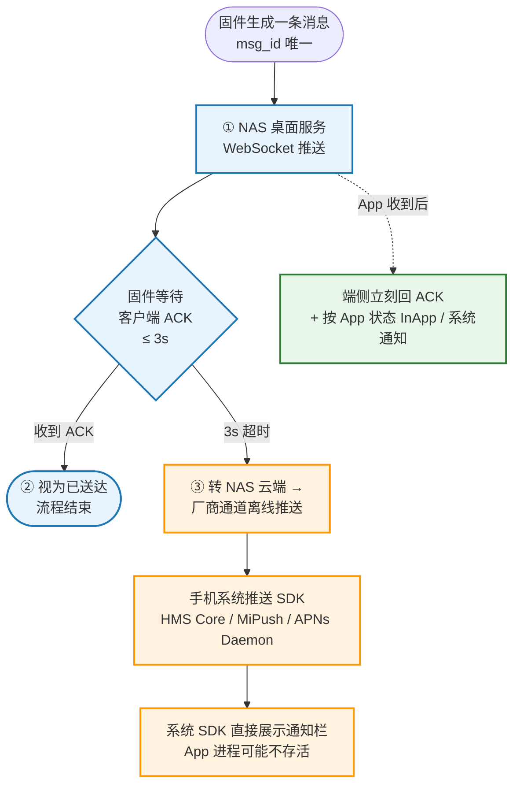
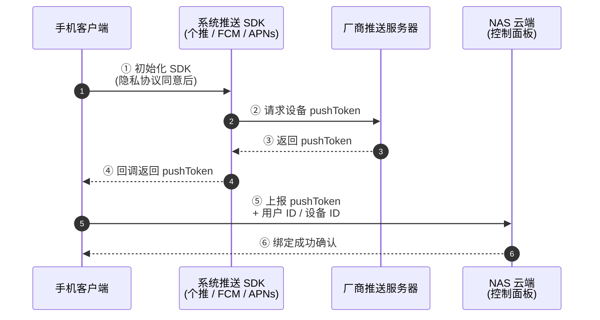
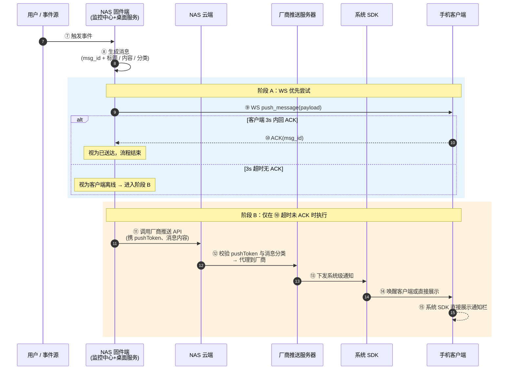
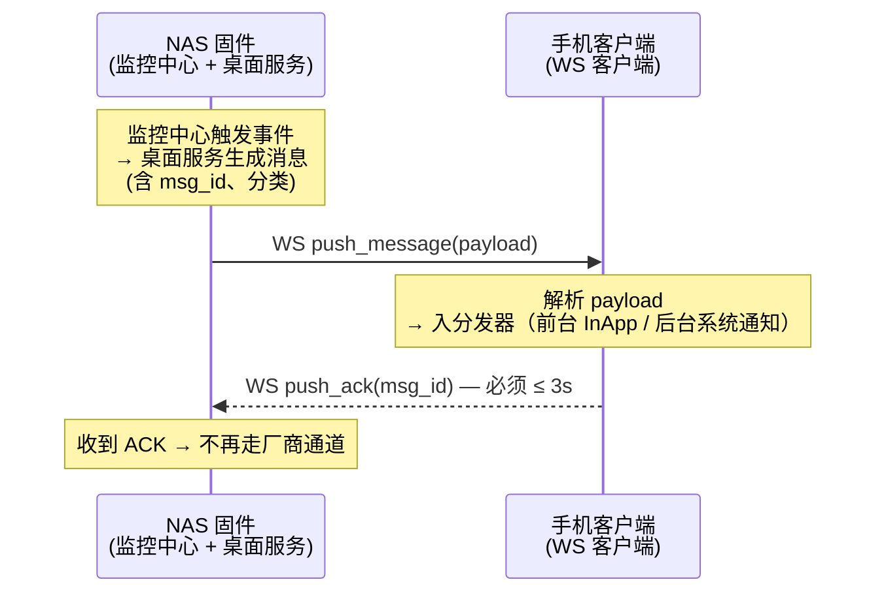
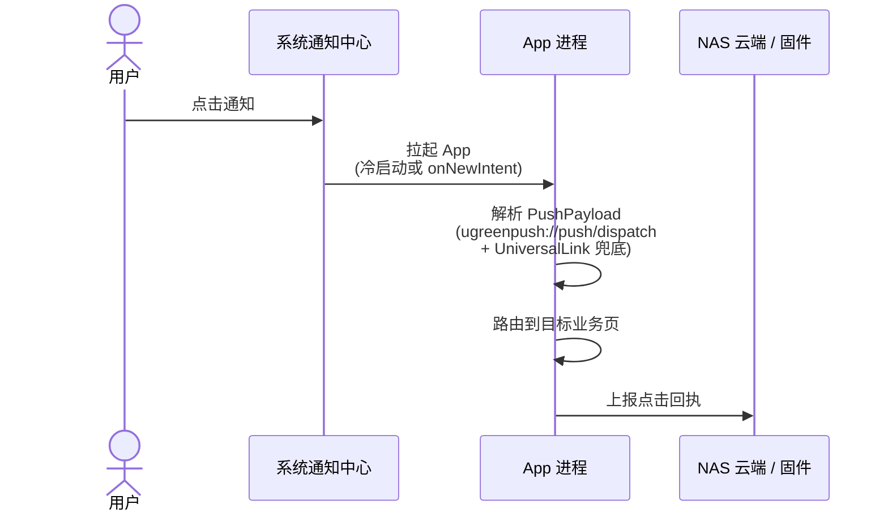
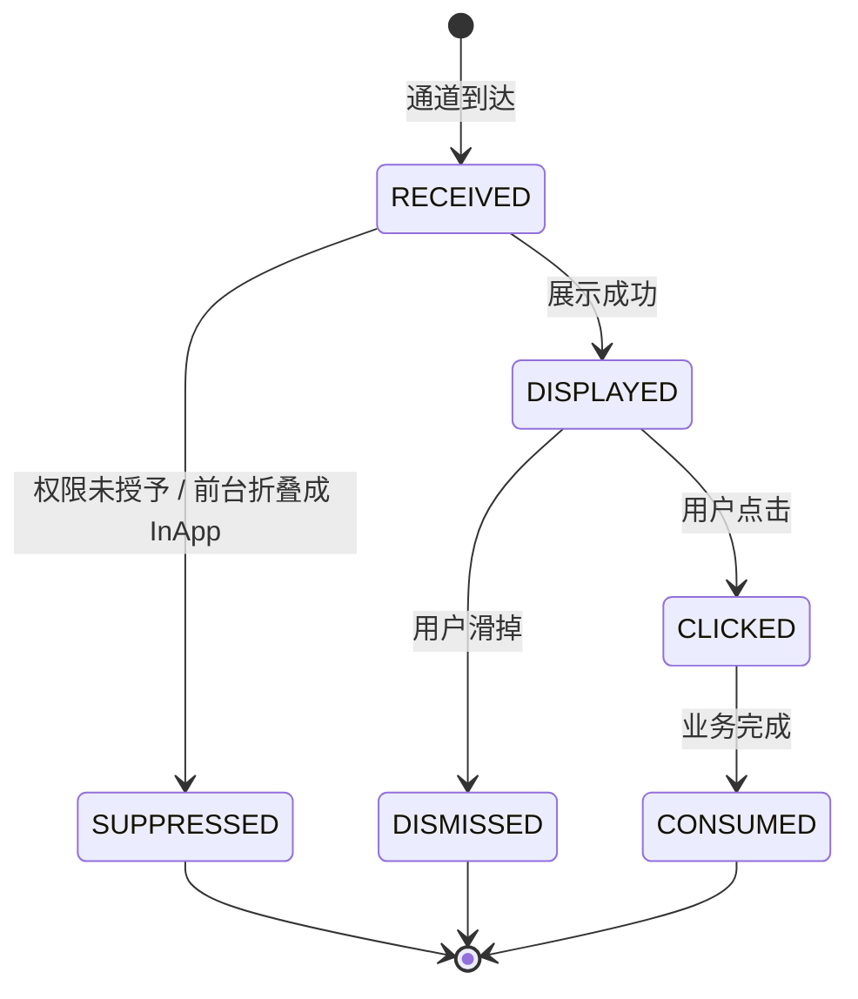
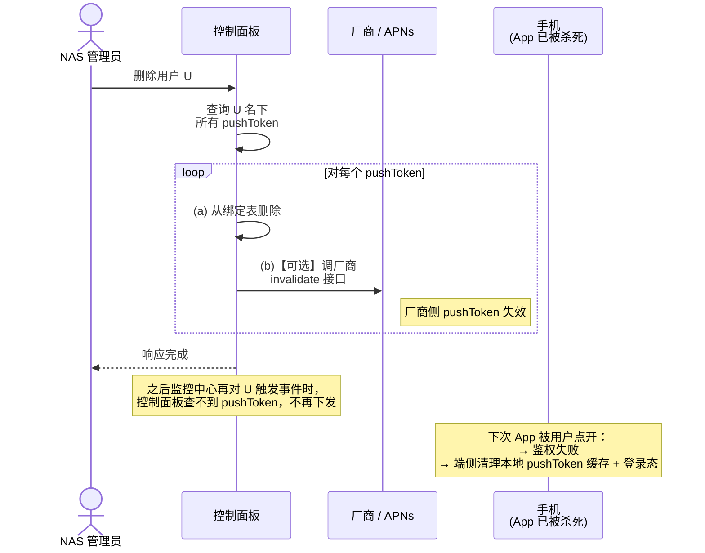
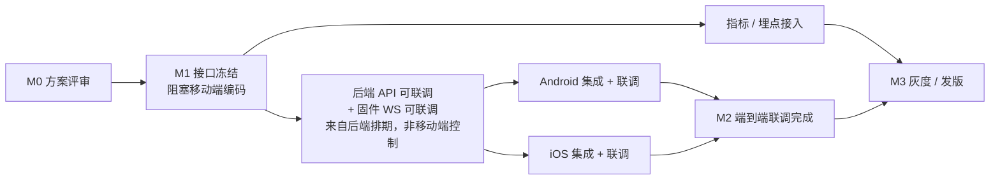

# 推送通知端到端技术方案

| 项目        | 内容                                                                                                                                                                    |
| --------- | --------------------------------------------------------------------------------------------------------------------------------------------------------------------- |
| 文档版本      | v1.7                                                                                                                                                                  |
| 作者        | 研发架构组                                                                                                                                                                 |
| 重心        | **移动端（Android + iOS）**                                                                                                                                                |
| 云端 / 固件章节 | 仅作为移动端的**契约背景参考**；云端与固件的完整方案以《接入手机消息推送服务后端技术方案设计》（NAS 部门后端团队，胡逸平，2026-04-18）为准                                                                                        |
| 评审角色      | 研发负责人 / Android TL / iOS TL / 后端对接人 / 固件对接人 / QA TL / 安全与合规 / PM                                                                                                      |
| 状态        | 草案（对齐后端方案后产出的 v1.1）                                                                                                                                                   |
| 适用范围      | UGREEN PRO 生态（NAS 设备 + 移动端 App + 云服务）下的通知类推送                                                                                                                          |
| 下钻文档      | Android：`docs/推送通知技术架构设计文档.md`（v1.5）<br/>iOS：`docs/iOS推送通知技术方案.md`（待产出，见 §8）<br/>后端/云端：《接入手机消息推送服务后端技术方案设计》（后端团队维护）<br/>固件/监控中心/桌面服务：《接入手机消息推送服务后端技术方案设计》同一文档（后端团队维护） |

> **定位声明**
>
> 本文档是**移动端视角**的端到端技术方案。之所以仍然覆盖云端与固件章节，是因为要让 Android / iOS 同学清楚地理解"我们对接的是什么、能依赖什么、边界在哪"，并将移动端实现中的**所有对外依赖**（API、消息格式、通道能力）落成白纸黑字的契约。\*\*\*\*
>
> 本文档不重新设计云端或固件，**凡是云端 / 固件章节出现的细节，均只列出"移动端可见的契约面"**，详细实现以后端团队提供的方案文档为准。如果发现本文档约定与后端方案冲突，**以后端方案为准**，并在本文档 §14 待决项中登记，由研发负责人拍板后回写修订。

***

## 阅读导引

- **PM / 业务方**：重点看 §1 背景目标、§2 总体架构、§9 接口契约中的消息分类表、§13 里程碑。

- **研发负责人 / 架构组**：通读一遍，重点评审 §2.3 选型决策、§6 移动端通用方案、§11 可用性容灾、§14 风险与待决项。

- **后端对接人**：重点看 §2、§3、§9.1\~§9.4，确认云端/固件提供的契约与后端方案一致。

- **Android TL**：重点看 §6 跨端对齐、§7，再下钻至 v1.5 文档完成具体开发。

- **iOS TL**：重点看 §6 跨端对齐、§8，并据此产出 iOS 专项详设文档。

- **QA TL**：重点看 §3、§6.5、§11、§12，验证 WS ACK ≤ 3s SLA 和"3s 超时切厂商通道"端到端用例，输出整体测试矩阵。

本文档定位是**移动端视角的端到端方案**，追求"契约清晰、移动端职责明确、与后端方案零冲突"。所有端内实现细节留给专项文档；凡是跨端协议约束、Payload 字段、错误码、指标口径，必须以**本文档为准**（若与后端方案冲突以后端方案为准）。

***

## 目录

- §1 背景与业务目标

- §2 总体架构

- §3 端到端数据流

- §4 云端技术方案（移动端契约背景）

- §5 固件技术方案（移动端契约背景）

- §6 移动端通用方案（Android + iOS 对齐）

- §7 Android 实现要点（引用 v1.5 专项设计）

- §8 iOS 实现要点

- §9 接口契约（移动端基线）

- §10 安全与合规（移动端视角）

- §11 可用性与容灾（移动端视角）

- §12 监控与指标（移动端）

- §13 里程碑与排期（移动端视角）

- §14 风险、假设与待决项

- 附录 A 术语表

- 附录 B Payload 字段字典

- 附录 C 错误码与状态码

- 附录 D 参考文档

***

## §1 背景与业务目标

### 1.1 业务背景

UGREEN PRO 生态由三类实体构成：

1. **NAS 设备（固件）**：部署在用户家庭/小微办公环境，运行绿联自研系统，承载存储、备份、相册、下载、安全扫描、系统升级等业务能力。
2. **移动端 App（Android + iOS）**：用户随身的控制端，承载远程访问、文件操作、媒体播放、状态监控等场景。
3. **云服务**：负责账号体系、设备绑定关系、远程穿透、订阅、pushToken 管理与厂商推送代理、OTA 分发等。

这三者通过云端汇聚，用户与设备是"多对多"关系（一个账号绑定多台 NAS，一台 NAS 可被多个账号访问）。

### 1.2 业务诉求

当前用户反馈与产品诉求集中体现为：

1. **设备侧事件**（如备份完成、磁盘异常、容量告警、登录告警、用户操作需审批、固件升级可用、安全扫描发现风险等）需要**实时触达**所有绑定该设备的用户。
2. **云端业务事件**（如订阅到期、账单、安全合规、账号异地登录、产品运营内容）也需要推送能力。
3. App **在前台**时，用户需要看到 In-App 的轻量提醒（Toast/红点/对话框），而非系统通知栏。
4. App **在后台或被杀死**时，用户需要看到**系统通知**，点击后跳回对应的业务页，且跳转参数（如目标 NAS 的 SN、具体备份任务的 ID）必须完整保留。
5. 终端用户对**到达率、时效性、准确性**敏感：不能漏推、不能晚推太多、不能重复推送、不能推给已解绑的用户。

### 1.3 目标与非目标

**目标（In scope）**：

- 建立端到端的**通知类**推送能力，覆盖国内与海外（Google Play 渠道）。

- 打通固件 → 云端 → 移动端的事件链路，提供稳定可观测的推送到达率（目标离线到达率 ≥ 92%，P95 端到端延迟 ≤ 8s）。

- **确定的通道选型（不再评估）**：App 在线走 **NAS 桌面服务 WebSocket**；App 离线走 **厂商通道**（cn 用 **个推 GTSDK** + 六大国内厂商通道 / google 用 FCM / iOS 用 APNs）。详见 §2.3。

- 建立多端**一致**的 Payload、跳转协议、去重策略、消息分类体系。

- 支持 **一号多端**（同一账号多设备并发在线，包括应用分身 / 双开）；**不支持一机多号**（一个 pushToken 仅绑定一个账号），详见 §3.6.1。

- 在 Android 16 / iOS 17+ 系统约束下保持稳定。

**非目标（Out of scope，本次不做）**：

- IM（一对一聊天、群组）能力：不在推送体系内实现。

- 大规模运营营销 Push（如促销）：采用独立的运营推送通道，与本次通知类推送解耦。

- 端对端加密（E2EE）：通知内容不涉及用户数据明文，因此不做 E2EE，仅保证传输层 TLS 与敏感字段脱敏。

- 离线消息补拉 30 天历史：本次只覆盖在线 + 近 7 天（可配置）。

- 富媒体 Push（大图 / 视频 Push / Live Activity 常驻）：iOS 预留接口，Android 暂不实现，列入 v2。

### 1.4 关键指标（North Star & Guardrail）

| 指标                | 定义                                 | 目标                               |
| ----------------- | ---------------------------------- | -------------------------------- |
| 端到端 P95 延迟        | 固件发事件 → 端收到通知                      | ≤ 8s                             |
| 离线到达率             | 服务端下发 → 设备回执（点击/展示）                | ≥ 92%                            |
| **WS ACK 时长 P95** | 端侧收到 WS push_message → 发出 ACK 的耗时 | **≤ 3s（端侧硬约束）**                  |
| 重复通知率             | 同一事件被用户看到 ≥ 2 次的比例                 | ≤ 0.5%（**由固件 3s 串行机制保证，端侧透明上报**） |
| 误推率               | 推给已解绑用户 / 已退订分类的用户                 | 0（硬约束）                           |
| 点击跳转成功率           | 点击后成功落到目标页                         | ≥ 99.5%                          |
| 前台折叠率             | App 前台时不弹系统通知的比例                   | 100%（硬约束）                        |

***

## §2 总体架构

### 2.1 架构分层（对齐后端方案）

整条链路涉及 6 个角色（严格按《接入手机消息推送服务后端技术方案设计》描述）：用户 / 事件源、NAS 固件端（监控中心 / 控制面板 / 桌面服务）、NAS 云端、厂商推送服务器、手机系统推送 SDK、手机客户端。

**架构图源文件**：`docs/推送通知架构图.drawio`

> 打开方式（任选其一）：
>
> - VS Code / Cursor 安装 "Draw\.io Integration"（`hediet.vscode-drawio`）扩展后直接双击打开
>
> - 浏览器访问 [app.diagrams.net](https://app.diagrams.net/)，菜单 **File → Open from → Device** 打开
>
> - IntelliJ IDEA / Android Studio 安装 "Diagrams.net Integration" 插件后双击

图中包含以下要素：

| 要素                   | 说明                                                         |
| -------------------- | ---------------------------------------------------------- |
| 实线箭头                 | 事件推送主路径，步骤 ⑦\~⑬ 对应 §3.2 两阶段时序图中阶段二的每一步                     |
| 虚线箭头                 | pushToken 注册与绑定路径（步骤 ⑤），对应 §3.1 阶段一                        |
| 绿色粗线                 | NAS 桌面服务 WebSocket 直达通道（走画布右侧垂直走线，与厂商推送链路不重叠），对应 §3.3      |
| 紫色（用户/事件源）           | 业务触发方                                                      |
| 蓝色（NAS 固件端）          | 三个子模块：监控中心 / 控制面板 / 桌面服务                                   |
| 黄色（NAS 云端 + 厂商推送服务器） | 云侧与第三方                                                     |
| 粉色（手机系统推送 SDK）       | 系统侧                                                        |
| 绿色（手机客户端）            | 本方案的重心；`MessageRouter` 用深绿加粗，表示两类通道消息在此汇聚 + 派发（v1.7 起不做去重） |

**关键差异（相比 v1.0 / 相比通用推送方案）**：

1. **WebSocket 在 NAS 固件的"桌面服务"，不在云端**。这是内网 / P2P 直连，App 在内网或通过云端穿透拿到该 WS 入口后直接连 NAS。
2. **消息内容由固件生成**（标题 / 内容 / 分类，时序图第 8 步）。云端只做 pushToken 管理 + 厂商推送代理，不渲染模板。
3. **云端是轻量代理**，对应后端方案中"云端：对接厂商推送服务，提供推送接口"这一行。
4. **pushToken 上报对象是"控制面板"**（负责用户登录 + 接收 pushToken），不是一个独立的"推送网关服务"。

### 2.2 关键组件职责

> 重点：**移动端直接对接的组件以加粗标注**。其他组件仅作为上下文理解，实现细节参考后端方案文档。
>
> **移动端不关心"事件由哪个固件子模块触发、是什么业务事件"**——事件由固件端生成并完成消息构造后统一下发，移动端只消费最终的 `PushPayload`。

| 组件                  | 所属  | 核心职责                                                                  | 移动端是否直连                  |
| ------------------- | --- | --------------------------------------------------------------------- | ------------------------ |
| NAS 固件端（整体）         | 固件  | 触发事件并生成推送消息（标题 / 内容 / 分类 / `msg_id`）。移动端不感知内部模块的划分与协作方式               | 否                        |
| 控制面板                | 固件  | 用户登录管理；**接收移动端上报的 pushToken**；**账号生命周期变更时主动解绑 pushToken**（见 §3.6.3）   | **是**（pushToken 上报、绑定管理） |
| 桌面服务                | 固件  | **WebSocket 连接中心**；在线消息通知                                             | **是**（WS 连接）             |
| NAS 云端（推送接口层）       | 云端  | 对接各厂商推送服务，提供统一推送接口；pushToken 校验与路由                                    | 否（由固件调用）                 |
| 厂商推送服务器             | 第三方 | HMS / MiPush / OPPO / vivo / Honor / FCM / APNs                       | 否（由 NAS 云端调用）            |
| 手机系统推送 SDK          | 系统  | 接收厂商推送；**App 离线 / 被杀死时由系统 SDK 独立完成通知分发（展示通知栏 / 唤醒 App）**，无需 App 进程参与  | **是**（客户端 SDK 集成）        |
| 厂商推送通道接入            | 移动端 | 集成 GTSDK / FCM / APNs，处理 pushToken 获取、在线消息回调、回执上报                     | -                        |
| NAS WebSocket 客户端   | 移动端 | 连接 NAS 桌面服务 WS，前台 / 在线时的主通道                                           | -                        |
| 消息路由（MessageRouter） | 移动端 | 把两类通道的消息都转成 `PushPayload`，路由到 InApp / System 分发器；**v1.7 起不做去重**       | -                        |
| InApp 分发器           | 移动端 | 前台渲染 Toast / 横幅 / 红点                                                  | -                        |
| System 通知分发器        | 移动端 | App 进程存活（在线）时构造系统通知栏、处理跳转 / 权限 / 分组。**离线状态的通知展示由系统 SDK 直接完成，不经过本分发器** | -                        |

> **通道选择责任划分（v1.7 重大变更）**
>
> - **通道由固件决定**：固件先发 NAS WS，3s 内拿不到客户端 ACK 才转走云端 + 厂商通道；同一条消息**不会**两条通路并发到达。
>
> - **App 进程存活**：通过 NAS WS 送进 App → MessageRouter → InApp（前台）或 System 通知（后台）；端侧必须 3s 内回 ACK。
>
> - **App 已被杀死 / 网络不可达**：WS 收不到 ACK → 固件转厂商通道 → 系统推送 SDK 按 payload 直接展示通知栏，App 不参与。
>
> - 用户点击离线通知后，由系统唤醒 App，此时走 `PushDispatchActivity` / iOS 的 `didReceive` 回调补齐"已显示 / 已点击"的业务回执上报（§6.4、§9.5）。

### 2.3 技术选型决策

> **核心选型均已拍板**，本节仅作记录。v1.7 起 `msg_id` 跨通道一致性不再是硬阻塞（端侧不做去重，详见 §14 D-14）。

| 议题                               | 最终选型                                                                                            | 理由 / 说明                                                                |
| -------------------------------- | ----------------------------------------------------------------------------------------------- | ---------------------------------------------------------------------- |
| App 推送通道总策略 ✅ **已定**             | **App 在线：NAS 桌面服务 WebSocket**（唯一在线通道）<br/>**App 离线：厂商通道**（见下两行）                                 | 在线通道走 NAS WS 已有链路，零新增长连；离线只依赖厂商通道的"展示模式"，系统 SDK 直接展通知，无需 App 进程参与      |
| Android 离线通道 ✅ **已定**            | **个推 GTSDK**（cn flavor，内含华为 HMS / 小米 / OPPO / vivo / 荣耀 / 魅族 六大厂商通道）<br/>**FCM**（google flavor） | 国内 FCM 不可用；个推已覆盖六大厂商，集成成本低；Google 版用 FCM 保到达率。**不再评估其他候选**             |
| iOS 离线通道 ✅ **已定**                | **APNs 直推**（Token-Based Authentication）                                                         | APNs 是唯一官方稳定通道                                                         |
| 移动端在线通道 ✅ **已定**                 | **NAS 桌面服务 WebSocket**                                                                          | 复用现有 NAS WS 通道，不新增云端长连                                                 |
| 厂商通道下发模式 ✅ **已定**                | **展示模式**（payload 由系统 SDK 直接渲染通知栏）                                                               | 离线场景下 App 进程可能不存活，透传模式无意义；展示模式更可靠、被系统限制更少（D-16 已关闭）                    |
| Payload 格式 ✅ **已定**              | **JSON**                                                                                        | 跨端调试友好；通知体积小，性能差异可忽略                                                   |
| 移动端统一 Payload 模型 ✅ **已定**        | **自建** **`PushPayload`** **标准**（§9.3）                                                           | 无论 WS 还是厂商推送进来，进入业务层前统一解包；Android / iOS 共享同一模型                         |
| 跨端跳转 scheme ✅ **已定**             | **统一** **`ugreenpush://push/dispatch`**                                                         | Android v1.5 已落地；iOS 用 UniversalLink 兜底                                |
| `msg_id` 生成方 ✅ **已定（跨通道一致性待确认）** | **由固件生成，端侧只消费**                                                                                 | 固件方案已定（固件生成消息内容），`msg_id` 必须跟随消息下发。**跨通道原样透传仍是 §14 D-14 的硬阻塞项**，须与后端对齐 |
| 客户端 PII 边界 ✅ **已定**              | **脱敏**                                                                                          | 避免第三方推送服务商看到用户敏感数据，由固件在生成消息时负责                                         |

### 2.4 通道选择策略（**固件主导，端侧无需感知**）

> **重大简化**：通道选择 **完全由固件决定**，移动端**不参与"在线 / 离线"判断、不做跨通道去重**。
>
> 这是与 v1.0 \~ v1.6 设计的根本差异，请评审时重点确认。

**固件侧规则**（移动端只需理解，不实现）：

1. 固件**先**通过 NAS 桌面服务 **WebSocket** 把消息推给客户端；
2. 固件等待客户端在 **3s 内** 回 `ACK`；
3. 若 3s 内收到 ACK → 任务结束（视为已送达）；
4. 若 **3s 超时未收到 ACK** → 固件视为客户端离线，转走"NAS 云端 → 厂商通道"做离线推送；
5. 这意味着：**对同一条** **`msg_id`，端侧最多只会收到一次（要么 WS、要么厂商通道，二者不会并发到达）**。

**对移动端的关键含义**：

| 关注点         | 移动端职责                                                                |
| ----------- | -------------------------------------------------------------------- |
| 通道选择        | **不参与**。WS 和厂商通道由固件串行决策，端侧分别在两条通路里被动接收                               |
| 在线 / 离线状态自检 | **不需要**。固件以"3s ACK 是否到达"作为唯一判定，端侧无须自我汇报                              |
| 跨通道去重       | **不需要**。固件保证同一条消息只走一条通路，不会出现"WS + 厂商通道"双到达                           |
| 唯一硬性约束      | 端侧收到 WS `push_message` 后**必须在 3s 内**回 `ACK`，否则固件会误判离线 → 用户被打扰多一次离线推送 |



**端侧硬性约束**（评审重点）：

1. **WS** **`push_message`** **必须在 3s 内回 ACK**（端侧 SLA），否则固件会误判离线，造成"用户先看到 InApp、几秒后又看到一次厂商通道的系统通知"——这种用户体验问题的根因在端侧 ACK 慢。
2. **不做去重**：端侧不维护 `MsgDeduplicator` / 去重 LRU；同一 `msg_id` 出现两次的情况由固件机制（3s 超时切换）保证不会发生，若仍发生属于固件 bug，端侧不掩盖。
3. **不做"在线 / 离线"自检**：端侧不向固件汇报自身状态、不判断"WS 是否连通就走厂商通道"；端侧只负责"两条通路里被动接收并展示"。
4. **不做本地模拟**：所有通知必须由固件 / 云端下发，端侧不构造"假通知"。
5. **离线厂商通道一律用"展示模式"下发**（payload 直接包含 `title` / `body` / `sound` / `click_action`，系统 SDK 按 payload 渲染）；不使用透传模式（D-16 已决，§14）。
6. **前台不弹系统通知栏**（仅当消息走 WS 到达且 App 在前台时生效，见 §6.4）；这是 UX 范畴，跟通道选择无关。

***

## §3 端到端数据流

本章节完全沿用《接入手机消息推送服务后端技术方案设计》§3.1 的时序图拆解，并从**移动端视角**补充每一步的端侧实现约束。

### 3.1 阶段一：pushToken 注册与绑定



**移动端约束**：

- ① 初始化 SDK **必须**在用户同意隐私协议之后（`preInit` / `initialize` 时机，见 Android v1.5 §隐私合规）。

- ④ 端侧在回调里拿到的 pushToken 类型对应本文档 `endpoint_type`：

  - Android cn：`android_cid`（个推 cid，即本文档口径下的 pushToken）

  - Android google：`android_fcm`（FCM registration token）

  - iOS：`ios_apns`（APNs device token，十六进制字符串）

- ⑤ 上报对象是 **NAS 云端的"控制面板"服务**（后端方案中"控制面板：用户登录管理，接收手机 pushToken"），API 见 §9.1。

- ⑤ pushToken 变更（卸载重装、iOS 换机、用户切换账号、FCM 轮换）端侧必须立刻重新上报，**旧 pushToken 如果能拿到应一并附带触发云端 invalidate**。

- ⑥ 绑定成功前端侧禁止把自己视为"可接收推送"状态；InApp 通知设置页展示"离线推送未绑定"。

- 失败重试：上报 ⑤ 失败按指数退避重试，最多 5 次，超过后延迟到下一次 App 恢复前台再试。

### 3.2 阶段二：事件触发与推送（**WS 优先 + 3s ACK 超时切换**）

> 与 v1.6 之前的"WS / 厂商通道并发"模型不同：本版本起，固件采用 **串行** 策略——先发 WS、3s 内拿不到 ACK 才走云端 + 厂商通道。端侧因此**不需要去重，不需要在线 / 离线判断**。



**移动端约束**：

- ⑧ 消息内容（标题 / 内容 / 分类）**由固件决定**，多语言问题 → §14 D-9。

- ⑨~⑩ **WS 通路**（端侧硬性 SLA）：

  - 收到 `push_message` 后**必须在 3s 内**回 `ACK`，否则固件会触发阶段 B，造成用户重复打扰；

  - ACK 必须在端侧"已基本能展示该消息"时回（解析 payload + 入分发器即可，无需等待 UI 真正绘制完成）；

  - 不在端侧做去重 / 在线状态自检，单纯按"收到就展示 + 立即 ACK"处理。

- ⑭~⑮ **厂商通道**（仅当端侧 3s 没 ACK 时才会进入，**App 通常已被杀死或断网**）：

  - 由系统推送 SDK 直接展示通知栏，**App 进程可能不启动**；

  - 用户点击时冷启动 App 走 ClickRouter 解析 Payload + 上报点击回执。

- 端侧每条消息渲染前仍需做：

  - **前台判断**：前台 → InApp（仅 WS 通路才会出现，因为厂商通道是 App 离线时才走）；后台 / 进程未存活 → 系统通知栏；

  - **权限判断**：未授予通知权限 → 无法展示，记端侧日志并在 App 内设置页提示；

  - **分类映射**：把固件下发的 `category` 映射到本地通知渠道 / category；

  - **回执上报**：展示成功后上报回执（接口归属 → §14 D-13）。

### 3.3 WS 通路细节（与 §3.2 阶段 A 配套）



**关键事实**：

- 同一个 `msg_id` **不会**通过两条通路同时到达：固件采用串行策略，WS 拿到 ACK 就不再走厂商通道。

- 端侧因此**不需要**维护 `MsgDeduplicator`、`UnifiedInbox` 去重、`dedup_key` 兜底等逻辑；这些在 v1.6 之前是为"双通道并发到达"准备的，本版本起全部移除。

- 端侧唯一需要保证的是 **3s 内 ACK**——这是"用户不会被同一条消息打扰两次"的根因。

### 3.4 点击跳转时序（iOS / Android 统一）



**注意点**：

- Android：厂商通道（华为/OPPO/vivo/荣耀）点击不会自动回执，端侧必须调 `PushManager.sendFeedbackMessage` 上报 actionid（见 Android v1.5 §5.3）。

- iOS：点击默认由系统回报到 APNs 吗？→ 不会。APNs 本身不上报点击，端侧必须在 `didReceive response` 中调用业务回执接口。

- 冷启动场景：App 被杀死时点击通知会拉起进程并经过 `onCreate` / `didFinishLaunching`，此时 Router 必须等 Application 初始化完成再跳，否则会崩溃。

### 3.5 消息状态机（端侧可感知的部分）

移动端只对从"送到端侧"到"用户消费"这一段有感知：



> 没有 `DEDUPED` 状态：v1.7 起端侧不做跨通道去重（固件保证一条消息只走一条通路）。

服务端状态（ROUTED / DELIVERED / EXPIRED / FAILED）由 NAS 云端维护，移动端不关心。

### 3.6 扇出（Fan-out）说明

**扇出由固件和 NAS 云端负责**（事件 → 绑定关系表 → 多 pushToken 并发下发）。移动端只接收自己 pushToken 对应的消息，不感知扇出过程。

#### 3.6.1 绑定关系模型：**一号多端、不支持一机多号**

> 约定：下文统一用 **pushToken** 表示"推送端点令牌"（在各通道里分别是个推 CID / FCM registration token / APNs device token），以此区别于账号登录态的 `access_token`。

| 绑定维度                     | 是否支持       | 说明                                                                                              |
| ------------------------ | ---------- | ----------------------------------------------------------------------------------------------- |
| 一号多端（一个账号绑多个 pushToken）  | ✅ 支持       | 账号 A 可以同时在 Android 手机、iOS 手机、Pad 上登录，每个 pushToken 独立收到同一条消息                                     |
| 一机多号（一个 pushToken 绑多个账号） | ❌ 不支持      | 一个 pushToken 在同一时间点只能关联一个 `account_id`                                                          |
| 双开 / 应用分身                | ✅ 视为"一号多端" | 双开出来的两个 App 进程会分别向厂商申请到 **两个不同的 pushToken**，系统和云端视角下是两个独立端点。即便物理上是同一台手机，也不算"一机多号"，按"一号多端"规则各自下发 |

**pushToken 管理表主键建议**（对齐上述语义）：

```
PRIMARY KEY (pushToken)                -- pushToken 唯一，保证不支持一机多号
UNIQUE KEY  (account_id, pushToken)     -- 账号维度去重
INDEX       (account_id)                -- 一号多端下发时按账号聚合
```

**新旧账号在同一 pushToken 切换时的幂等处理**（由 NAS 云端控制面板保证，移动端只需正确上报）：

1. 旧账号 A 注销 / 退登时，移动端应主动调用解绑接口（§9.1）将 `pushToken` 从账号 A 下摘除；
2. 若未调用解绑就直接切到新账号 B：新账号登录后上报同一 `pushToken`，服务端应自动把该 pushToken 从账号 A 的绑定关系中剔除并改绑到 B（"后到覆盖"）；
3. 服务端不得出现"同一 pushToken 同时绑定 A 和 B"的状态。

> 该规则与 §9.1 pushToken 绑定 / 解绑 API 的幂等语义一致；移动端不做账号级唯一性维护，只保证"每次账号切换 / 注销都如实上报"。

#### 3.6.2 多端同账号下发

同一账号可能有 Android + iOS 两台设备，或一台 Android + 一个分身进程同时在线。**NAS 云端按 pushToken 逐条下发**，每个 pushToken 各自经过（厂商推送 SDK 或 NAS WS 通道）送到对应的 App 实例。移动端无需做任何额外事情：每台设备 / 每个实例都只会收到 **发给自己 pushToken 的那一条**。

服务端在一次扇出里如需为同一业务事件区分多个 pushToken，应使用同一 `msg_id`（见 §9.2）。移动端的 `MessageRouter` 按"收到即派发"处理（v1.7 起不做去重），因此同账号多端收到的"同一条消息"在各端独立计数、独立标记已读，互不影响。

#### 3.6.3 NAS 端主动解绑 pushToken（账号生命周期变更）

存在一类 **移动端无法主动感知** 的场景，必须由 **NAS 控制面板主动解绑 pushToken**，否则会造成"账号已失效但仍向该手机推送"的合规与隐私问题。

**典型场景**：

1. 用户 U 在手机上登录了 App，推送 SDK 初始化完成并上报了 `pushToken` 到控制面板，完成绑定；
2. 随后 App 被系统 / 用户清理、被杀死，App 进程不再存活；
3. 同时，NAS 管理员（另一个账号）在 NAS 端把用户 U 删除 / 停用 / 改密 / 降权；
4. 此时 U 的 pushToken 在控制面板的绑定表里仍然存在，如果不处理，后续对 U 的推送事件会照常下发，被删除的用户仍会在手机上看到通知。

**处理规则（控制面板侧）**：

| NAS 侧账号事件     | 控制面板应执行的 pushToken 操作                                                           |
| ------------- | ------------------------------------------------------------------------------- |
| 账号被删除         | 立即解绑该账号名下所有 pushToken（等价于逐个调 §9.1.2）                                            |
| 账号被停用 / 禁用    | 同上，或标记为"暂停下发"（由后端决策，对移动端无感）                                                     |
| 账号密码重置 / 凭证轮换 | 废弃该账号此前的 `access_token`；是否解绑 pushToken 由后端决定，若不解绑则应在 App 下次启动鉴权失败时走 §9.1.1 重新认领 |
| NAS 设备从用户名下移除 | 解绑该 NAS 对应的 pushToken（按 `device_sn` 过滤）                                         |

**移动端的补偿行为**（App 下次被唤起 / 恢复前台时）：

- 用户点击通知 / 主动打开 App → 走鉴权流程 → 发现账号已失效 → 清理本地登录态 + MMKV 中的 pushToken 记录 + 跳到登录页；

- 若能拿到"账号已被删除"这一具体错误码，UI 上给出明确提示；

- 无论如何 **不要再用失效账号的** **`access_token`** **去调 §9.1 接口**，避免打乱服务端状态。

**时序示例**：



**对移动端的契约要求**：

- 控制面板 **不依赖** 移动端主动做什么来完成"删用户时解绑"；移动端也不会收到"账号被删"的实时通知（App 已死）；

- 移动端只需保证：下次启动后鉴权失败时清理本地缓存，不带着失效的 pushToken 去上报；

- 若 App 仍在前台 / 存活且走的是 NAS WS 主通道，服务端可以 **通过 WS 的** **`session_invalidate`** **/** **`force_logout`** **事件** 主动通知端侧下线（此事件定义见 §9.3 WS 协议扩展，属于可选能力，不是本方案硬依赖）。

***

## §4 云端技术方案（移动端契约背景）

> **本章不是云端设计文档**，只描述"移动端对云端的依赖面"。云端的完整设计以《接入手机消息推送服务后端技术方案设计》为准。

### 4.1 云端的角色定位（后端方案原话）

> 云端：对接厂商推送服务，提供推送接口

结合时序图可知云端在整条链路中做两件事：

1. **pushToken 管理**（接收移动端通过"控制面板"上报的 pushToken，做路由 / 校验 / 失效处理）
2. **厂商推送代理**（接收固件调用的推送 API，转调各家厂商推送服务器）

**云端不做** 的事（v1.0 曾假设做、v1.1 移除）：

- ~~消息模板 / 多语言渲染~~（由固件完成）

- ~~账号扇出 / 复杂路由决策~~（由固件结合 NAS 本地绑定关系完成）

- ~~Kafka 事件总线 / 重试编排~~（后端方案未引入）

- ~~WebSocket 接入层~~（由 NAS 桌面服务直接提供）

### 4.2 移动端对云端的依赖面

| 依赖                | 方式                                                      | 备注                     |
| ----------------- | ------------------------------------------------------- | ---------------------- |
| pushToken 上报 / 解绑 | HTTPS，调用 NAS 云端"控制面板"服务（§9.1）                           | pushToken 实际落盘在 NAS 云端 |
| pushToken 失效通知    | 由云端在厂商返回 `BadDeviceToken` / `NotRegistered` 时回收；移动端无需感知 | 下次上报时覆盖即可              |
| 推送回执接口（可选）        | HTTPS，归属待定（控制面板 or 云端代理）                                | §14 D-13 待决            |

**除上表外，移动端与云端无直接交互**。

### 4.3 对云端的反向依赖（移动端希望云端保证的行为）

虽然这些不由移动端实现，但在对接评审中需与后端团队确认：

1. **pushToken 幂等**：同一 `(account_id, endpoint_type, pushToken)` 多次上报必须幂等，不产生多条绑定。
2. **pushToken 去冗余**：同一 `(account_id, endpoint_type)` 的旧 pushToken 在上报新 pushToken 时软删除；失效 pushToken 及时回收。
3. **pushToken 唯一性（对应 §3.6.1 一机多号约束）**：`pushToken` 在全表范围内同一时刻只允许绑定一个 `account_id`；同一 pushToken 切账号时按"后到覆盖"处理，不得出现同一 pushToken 绑多个账号的状态。
4. **账号生命周期联动（对应 §3.6.3）**：账号被删除 / 停用 / 密码重置 等事件必须由控制面板 **主动清理该账号名下的所有 pushToken 绑定**，不依赖移动端触发。
5. **推送限流**：云端应对厂商 API 做基础限流，避免因固件异常刷爆厂商额度。
6. **推送回执透传（可选）**：厂商回执（下发成功/失败）理想状态下应暴露给固件或 NAS 云端用于重试决策，本方案不强求。
7. **`msg_id`** **透传**：固件生成的 `msg_id` 建议原样透传至厂商推送 payload（便于端侧日志关联），不被云端改写。**v1.7 起端侧不依赖此一致性做去重**，但保持一致仍是良好实践。

***

## §5 固件技术方案（移动端契约背景）

> **本章不是固件设计文档**，只描述"移动端对固件的依赖面"。固件的完整设计以《接入手机消息推送服务后端技术方案设计》为准。

### 5.1 固件侧涉及的三个子系统（后端方案定义）

| 子系统  | 职责（后端方案原文）                                        | 移动端交互                    |
| ---- | ------------------------------------------------- | ------------------------ |
| 监控中心 | 事件触发方，调用桌面服务 gRPC 接口发送通知                          | 否（App 不直接对接）             |
| 控制面板 | 用户登录管理，接收手机 pushToken 等信息；账号生命周期变更时主动解绑 pushToken | **是**（pushToken 上报、绑定管理） |
| 桌面服务 | WebSocket 连接中心，消息通知管理中心                           | **是**（WebSocket 长连接）     |

### 5.2 事件到消息的转换（固件内部，移动端只消费结果）

后端方案时序图第 ⑧ 步"生成推送消息（标题、内容、分类）"发生在固件侧。移动端只需要关注**消息到达端侧时携带的字段**，字段契约见 §9.3。

**移动端依赖**（固件必须提供）：

- 每条消息带有**全局唯一** `msg_id`（用于端侧日志关联，串起 ACK / 展示 / 点击事件）

- 每条消息带有 `category`（用于通道映射、分组、退订）

- 标题 / 内容是**已渲染**的可读文案（已根据用户 locale 处理；若不支持 locale，则默认中英按固件本地配置，移动端不做二次渲染）

- 可选 `target_page` + `target_args` 跳转语义（见 §6.3）

### 5.3 移动端对固件的反向依赖

在对接评审中需与固件 / 后端团队确认：

1. **3s ACK 切换机制（v1.7 核心）**：固件先发 NAS WS，3s 内收不到端侧 ACK 即转走云端 + 厂商通道；这套机制是端侧"无需去重 / 无需在线状态自检"的根因，固件必须严格落地。
2. **`msg_id`** **生成**：`msg_id` 应由固件在 ⑧ 步生成，保证全局唯一；建议同一条消息在 WS 与厂商通道下发时保持一致（便于端侧日志关联），但端侧不再依赖此一致性做去重。
3. **WebSocket 消息格式**：NAS 桌面服务 WS 推送的 `push_message` 消息体应与厂商推送的透传 payload 保持一致字段（见 §9.2）。
4. **消息分类枚举**：固件应采用本方案 §9.2 定义的 `category` 枚举草案，或提供固件分类 ↔ 本方案 category 的映射表（§14 D-11）。
5. **Payload 体积**：下发给厂商通道前，固件需确保 payload 不超过厂商通道的限制（APNs ≤ 4KB、FCM ≤ 4KB、个推厂商通道 body ≤ 1024B）；超限场景的处理（截断 / 点击拉取全文）由固件决定，移动端只消费到达的字段。

### 5.4 固件侧常见事件源（供移动端理解业务语义）

| 事件类型  | 示例                       | 建议 category                            |
| ----- | ------------------------ | -------------------------------------- |
| 存储    | 磁盘 SMART 异常、RAID 降级、容量告警 | `system.critical` / `device.status`    |
| 备份/相册 | 任务完成、失败、超时、配额超限          | `device.task`                          |
| 下载/离线 | 离线任务完成、失败                | `device.task`                          |
| 安全    | 异地登录、可疑文件扫描              | `system.critical` / `account.security` |
| 系统/升级 | 新固件可用、升级完成               | `system.info`                          |
| 用户/权限 | 新用户注册审批、访问请求             | `social.share`                         |

此表不是硬约束，最终以固件/后端团队发布的事件清单为准。

***

## §6 移动端通用方案（Android + iOS 对齐）

这一章是全文档最关键的"对齐"部分。Android 和 iOS 的实现差异巨大，但**对外契约、Payload、跳转协议、ACK SLA、分类模型**必须完全一致。

### 6.1 统一的端上组件模型

无论 Android 还是 iOS，移动端都抽象出以下逻辑组件（不对应具体类名，由各端按自己的平台习惯实现）。**v1.7 起取消** **`MsgDeduplicator`**——固件保证消息只走一条通路，端侧无须跨通道去重。

| 组件                   | 职责                                                                                   | Android 对应                                   | iOS 对应        |
| -------------------- | ------------------------------------------------------------------------------------ | -------------------------------------------- | ------------- |
| PushEndpointManager  | 申请 / 刷新 pushToken（cid / FCM registration token / APNs device token）、上报绑定到控制面板        | `PushManager` + `GeTuiInitTask`              | （待 iOS TL 确认） |
| VendorChannelAdapter | 接入厂商推送 SDK 的搬运层（GTSDK / FCM / APNs），把原生 payload 翻译成统一 `PushPayload`                  | `GeTuiIntentService` / `FcmMessagingService` | （待 iOS TL 确认） |
| NasWsChannel         | 连接 NAS 桌面服务的 WebSocket；收 `push_message` 后**立即** 回 ACK（≤ 3s 硬约束），再翻译成统一 `PushPayload` | 复用项目现有 WebSocket 框架                          | （待 iOS TL 确认） |
| MessageRouter        | 把两类通道送来的 `PushPayload` 派发到 InApp / System 分发器；**不做去重**                               | 统一入口类                                        | （待 iOS TL 确认） |
| InAppDispatcher      | 前台时以 App 内组件形式展示                                                                     | （见 Android v1.5）                             | （待 iOS TL 确认） |
| SystemDispatcher     | 后台时构造 / 更新 / 取消系统通知                                                                  | `NotificationDispatcher`                     | （待 iOS TL 确认） |
| ClickRouter          | 点击通知解析 Payload 并路由                                                                   | `PushDispatchActivity` + TheRouter           | （待 iOS TL 确认） |
| ReceiptReporter      | 业务回执上报（展示 / 点击 / 关闭）                                                                 | `PushReceiptSender`                          | （待 iOS TL 确认） |

> **v1.7 关键变化**：
>
> - 删除 `MsgDeduplicator` 组件——消息去重责任完全在固件侧（通过 3s ACK 切换保证不重复下发）。
>
> - 原 `UnifiedInbox` 改名为 `MessageRouter`，职责仅剩"派发"，不再承担"去重"——避免误导。
>
> - `NasWsChannel` 新增最高优先级的硬性责任：**收到消息必须 3s 内回 ACK**，否则触发固件转厂商通道补发，造成重复打扰。

### 6.2 统一 Payload 契约（关键）

移动端**只认识一种 Payload**，无论从 NAS WS、个推、FCM、APNs 哪个通道进来，经过解码后都映射为同一个 `PushPayload` 结构（见 §9.3）。各通道的 Payload 包装仅在"搬运层"（VendorChannelAdapter / NasWsChannel）存在，进入 `MessageRouter` 之前必须统一解包。

**好处**：

- 跳转协议、回执、InApp 渲染都只有一套逻辑，iOS / Android 各自维护一份翻译层即可。

- 单元测试只需针对 `PushPayload` 写一份，覆盖所有通道 / 双端场景。

- 新增通道（如未来 HarmonyOS、HMS 海外、华为快应用等）只需增加一个翻译器，业务层零改动。

### 6.3 统一跳转协议（关键）

**Scheme**：`ugreenpush://push/dispatch?push_payload={URL_ENCODED_JSON}`

- Android：由 `PushDispatchActivity` 拦截（v1.5 已落地），处理 intent 解析、厂商点击回执、signer/pkg 校验。

- iOS：由 Universal Link + Custom Scheme 双配置拦截，处理流程详见 §8.4。

**禁止**在 Payload 里直接塞 Intent URL（Android）或 UserActivity（iOS）等端相关结构。服务端**只传语义字段**（`target_page` + `target_args`），由端内 Router 翻译成具体目标。

**target_page 白名单**：

> ⚠️ **待定**：具体的页面枚举和跳转参数需由产品 + 前后端共同定义后填入。以下为占位示意。

| target_page | 说明     | 必需 args |
| ------------ | ------ | ------- |
| `home`       | 主页（兜底） | -       |
| （其他页面待确认）    | -      | -       |

无论最终枚举值如何，端上实现必须遵守：**未识别的** **`target_page`** **一律回退到** **`home`，不崩溃**。

### 6.4 前台/后台状态下的展示规则

> v1.7 起，**同一条** **`msg_id`** **不会被两条通路同时送达**（固件 3s ACK 串行机制保证）。下表只描述"端侧拿到一条消息后该如何展示"。

| App 状态                                 | 通道（已由固件决定）                  | 端侧行为                                                                                             |
| -------------------------------------- | --------------------------- | ------------------------------------------------------------------------------------------------ |
| 前台活跃（Android `RESUMED` / iOS `active`） | 必然是 NAS WS（厂商通道只在离线时走）      | InApp 横幅 / Toast / 红点；**不弹系统通知**；立即回 ACK ≤ 3s                                                    |
| 后台（进程存活，WS 仍连）                         | 必然是 NAS WS                  | 构造系统通知栏；分类规则按 `category` 决定（`system.critical` / `account.security` 强通知栏，其他分类可只维护红点）；立即回 ACK ≤ 3s |
| 被杀死 / 网络不可达                            | NAS WS 收不到 → 固件 3s 后自动转厂商通道 | App 不参与；系统 SDK 直接展示通知栏，点击时冷启动走 ClickRouter                                                       |

### 6.5 端上去重与幂等（**v1.7 起：端侧不实现**）

> v1.7 重大变更：取消端侧 `MsgDeduplicator` 与所有跨通道去重逻辑。

**新责任划分**：

| 维度                         | 由谁保证                                                      |
| -------------------------- | --------------------------------------------------------- |
| 同一 `msg_id` 不会通过两条通路同时到达   | **固件**（3s ACK 串行机制，见 §3.2）                                |
| 同一 `msg_id` 不会被云端 / 厂商重复下发 | 后端 / 云端（标准幂等设计）                                           |
| 端侧偶发收到两条相同 `msg_id` 怎么办    | **不掩盖**，按收到的次数展示。日志中记录"重复消息" 上报到监控（§12），便于反向追固件 / 云端的 bug |

**为什么不在端侧做防御性去重？**

- 端侧若静默吞掉重复，会**掩盖固件 bug**——3s ACK 机制是否真的工作，端侧团队和固件团队之间没有可观测信号；

- 端侧 LRU / 持久化方案在杀进程、卸载重装、多设备场景下有大量边界 case；

- 维护这部分代码的成本 > 直接靠固件保证带来的成本。

**端侧需要保证的**：收到 WS 消息后**立即**回 ACK（≤ 3s SLA），这是避免重复打扰的根因。

### 6.6 权限与用户设置

- **通知权限**：Android 13+ / iOS 全版本需要运行时申请。授权前只能使用 InApp 通知，不能落通知栏。

- **分类退订**：App 内设置页提供一份全局分类开关（映射到 §9.3 的 category 表）；关闭的分类上报给 NAS 云端控制面板（或固件），推送端不再下发。

- **免打扰时段**：端上本地实现"静默时段"，在本地静默时段内延迟非 critical 类消息到下一个活跃窗口。

- **本地 log**：端上保留最近 100 条推送事件（展示 / 点击 / 跳转 / 错误 / WS ACK 耗时）到 Debug 页，用于用户反馈排查。

### 6.7 版本兼容与向前演进

- Payload 增字段：端上必须使用"未知字段忽略"策略解析（Gson `allowMissingField` / Codable 的 `decodeIfPresent`）。

- 通道切换：同一账号先后出现 `android_cid` → `android_fcm`（用户换机到 Google 版），云端依靠新 pushToken 上报覆盖旧记录，推送只走当前活跃 endpoint。

- 协议版本：Payload 顶层字段 `schema_version`，端上遇到高于已知版本时降级到 `home` 兜底跳转，不崩溃。

- 通道新增：若未来固件扩展新通道（HarmonyOS Push / 华为海外 HMS），新增一个 `VendorChannelAdapter` 实现即可，业务层零改动。

### 6.8 端侧关键约束（**v1.7 重写：以 ACK SLA 为核心**）

这是本文档对端侧最重要的实现规约，也是对接评审的关键检查点：

1. **WS** **`push_message`** **ACK ≤ 3s（硬约束）**：

   - 这是端侧最重要的对外承诺。固件以此判断"客户端是否在线"；

   - 端侧解析 payload + 入分发器 → 立即回 ACK。**不要**等 UI 真正绘制完成、不要等用户点击；

   - 评审重点：ACK 路径上不能出现"等待业务初始化、等待用户登录、等待权限弹窗"等阻塞。
2. **不做跨通道去重**：端侧不维护 `MsgDeduplicator` / `dedup LRU`；同一 `msg_id` 重复到达视为固件 bug，**透明展示并上报监控**（§12），不要静默吞掉。
3. **不做"在线 / 离线"自检**：端侧不向固件汇报 WS 连通状态，固件只看 ACK；端侧不要尝试"检测 WS 不通就主动走厂商通道"——通道选择完全由固件决定。
4. **NAS WS 收到的消息**对应 App 进程必然存活的场景：

   - 前台 → InApp 渲染；

   - 后台 → 系统通知栏（按 `category` 决定是否落通知栏，见 §6.4）。
5. **厂商通道收到的消息**对应 App 已死或网络不可达的场景：

   - 系统 SDK 直接代展示，App 不参与；

   - 用户点击时冷启动走 ClickRouter，buffer 住事件直到 `Application` / `SceneDelegate` 基础初始化完成。
6. **前台可见性的判定**：

   - Android：`ProcessLifecycleOwner.get().lifecycle.currentState >= RESUMED`

   - iOS：`UIApplication.shared.applicationState == .active`
7. **`msg_id`** **仅作为日志关联键**，不再作为端侧去重键；用于把"WS push_message → ACK → 后续展示 → 点击回执"串成一条链路，方便监控分析端到端链路。

***

## §7 Android 实现要点（引用 v1.5 专项设计）

**Android 专项设计文档**：`docs/推送通知技术架构设计文档.md`（v1.5），已与本总体方案对齐。

本章只列与端到端架构强相关的关键点，实现细节不重复。

### 7.1 关键落位

| 通用组件（§6.1）          | Android 实现                                                                              |
| ------------------- | --------------------------------------------------------------------------------------- |
| PushEndpointManager | `GeTuiInitTask`（FlowTask）+ `PushManager` 绑定上报                                           |
| PushChannel (WS)    | 复用现有 WebSocket 长连接                                                                      |
| InAppDispatcher     | `LiveEventBus` 事件 + 业务 UI 组件                                                            |
| SystemDispatcher    | `NotificationDispatcher` + NotificationCompat                                           |
| ClickRouter         | `PushDispatchActivity`（配置 `ugreenpush://push/dispatch` intent-filter，校验调用方） + TheRouter |
| ReceiptReporter     | `PushReceiptSender`（合并展示/点击/关闭上报）                                                       |

### 7.2 渠道差异

- **国内（`cn`** **flavor）**：个推 GTSDK + 华为/小米/OPPO/vivo/荣耀 厂商通道。

- **海外（`google`** **flavor）**：只集成 FCM（**不集成**任何国产厂商 SDK，避免 Google Play 审核问题）。

- 两个 flavor 共享 §6 通用模型，PushEndpointManager 不同实现类，注入到相同接口。

### 7.3 Android 关键约束（Android 16 适配）

- 后台启动 Activity / Foreground Service 全面受限：**推送处理必须在进程已启动的生命周期内完成**。不能依赖后台自启。

- Predictive Back：通知跳转的任务栈必须正确，避免返回错位。

- 16KB 页对齐：所有 native so 必须升级（个推、厂商 SDK 版本见 v1.5 §10.2）。

- POST_NOTIFICATIONS 运行时权限：未授权时云端仍下发，但端侧不展示；端侧需要在合适时机（设置页、首次进入某业务）引导授权。

### 7.4 与本文档的强依赖点

- §6.3 scheme 统一为 `ugreenpush://push/dispatch`：v1.5 已落地。

- §9.3 Payload 字段：v1.5 已覆盖。

- §9.5 回执字段：v1.5 实现 `PushReceiptSender`，并对个推厂商通道点击补齐 `sendFeedbackMessage`（actionid 60020/60030/60040/60070）。

### 7.5 工作量

Android 端剩余工作量（从 v1.5 估算）≈ **15.5 人日**，详见 v1.5 §14。不在本总体方案重复。

***

## §8 iOS 实现要点

iOS 部分目前项目中不存在成熟推送实现，本章给出**从零搭建**的框架方案，作为 iOS TL 产出专项详设的基线。

### 8.1 通道选型

| 场景                             | 通道                                             |
| ------------------------------ | ---------------------------------------------- |
| 在线（App 前台）                     | WebSocket（与 Android 相同）                        |
| 离线远程推送                         | **APNs (HTTP/2 + Token-Based Authentication)** |
| 静默推送（Silent Push）              | APNs `content-available=1`                     |
| 富媒体（图片/视频预览）                   | APNs + NotificationServiceExtension 下载附件       |
| Live Activity / Dynamic Island | 后续 v2 能力，本期不做                                  |
| VoIP                           | **不用**（业务上不是 VoIP 场景，Apple 严控滥用 PushKit）       |

**关键**：iOS 只信 APNs。个推 iOS 只能作为"服务端路由工具"（调 APNs 的代理），**不会**提高到达率，但会增加一层链路。本方案**直接由云端调用 APNs**，不经过个推 iOS。

### 8.2 证书与配置

- **APNs Auth Key（.p8）**：推荐使用 Token-Based 而非传统证书，有效期更长、更换简单。

- 生产和开发环境分离：`development` / `production` 两个 topic。

- **Push Notifications Capability**：Xcode 项目开启，Entitlement 生效。

- **App Groups**（若使用 NSE）：Main App 和 NSE 共享 UserDefaults 以存储待上报回执等共享状态。

- **Critical Alerts**：`system.critical` 类若需要在 iOS 勿扰模式下响铃，需要 Apple 批准 `com.apple.developer.usernotifications.critical-alerts`（需单独申请）。初版不申请，统一走普通 Alert。

### 8.3 组件职责

#### 8.3.1 `AppDelegate` / `SceneDelegate`

- `didFinishLaunchingWithOptions`：注册 `UNUserNotificationCenter.delegate`，调 `application.registerForRemoteNotifications()`。

- `didRegisterForRemoteNotificationsWithDeviceToken`：拿到 APNs device token（即本文档的 pushToken）后走 `PushEndpointManager` 上报绑定。

- `didFailToRegisterForRemoteNotificationsWithError`：错误分级处理，记录日志，重试策略同 Android。

- `didReceiveRemoteNotification`（静默推送）：处理 `content-available=1` 的后台刷新，不弹通知。

#### 8.3.2 `UNUserNotificationCenter.delegate`

> ⚠️ 以下为**示意性伪代码**，具体实现（含类名、方法名、解析逻辑）由 iOS TL 在专项详设文档中定义。

```swift
// 前台时（App 在前台）收到推送 —— 示意性伪代码，非最终实现
func userNotificationCenter(_:willPresent notification:withCompletionHandler:) {
    // 1. 从 userInfo 中按后端约定的 key（待定）解出 PushPayload
    // 2. 前台：交给 InAppDispatcher 渲染，抑制系统通知横幅
    //    （v1.7 起端侧不做去重；如有重复，作为监控数据上报但仍展示）
    // 3. 上报展示回执（接口待定，见 §9.5）
}

// 用户点击通知 —— 示意性伪代码，非最终实现
func userNotificationCenter(_:didReceive response:withCompletionHandler:) {
    // 1. 解析 PushPayload（key 待定）
    // 2. 根据 target_page + args 走 Router 路由（页面枚举待定，见 §6.3）
    // 3. 上报点击回执（接口待定，见 §9.5）
}
```

#### 8.3.3 `NotificationServiceExtension`（NSE）

**用途**：

1. 修改通知内容（例如根据本地缓存替换文案、追加设备名）。
2. 下载附件（图片、短音频）。
3. 做"到达即上报"——iOS 并不保证 app 进程一定醒，NSE 能在后台独立执行一小段代码，适合上报"delivered"回执。

**关键约束**：

- NSE 只有 \~30s 执行时间，必须谨慎处理网络请求。

- NSE 和主 App 通过 App Group 共享 UserDefaults 做待上报回执缓存等共享状态。

- 必须处理 NSE 被系统杀掉的兜底（超时回调会传原 content）。

#### 8.3.4 `NotificationContentExtension`（本期可选）

如业务希望在长按/下拉通知时展示自定义富界面（如备份任务进度条），引入此扩展。初版不做。

### 8.4 跳转协议 & Universal Link

iOS 点击通知的跳转不使用自定义 scheme（外部浏览器无法识别），采用：

- **通知内部跳转**：通知 payload 带 `target_page` + `target_args`，app 拿到后内部路由，不需 URL。

- **通知外 deeplink**（例如邮件里的链接指向 App 某页）：用 Universal Link `https://app.ugreen.com/push/dispatch?payload=...`。

- 保留 custom scheme `ugreenpush://push/dispatch` 作为兜底。

Universal Link 与服务端 `apple-app-site-association` 文件需预先配置（域名、路径前缀）。

### 8.5 前台/后台与 Silent Push

| 场景           | APNs 字段                            | 端上处理                              |
| ------------ | ---------------------------------- | --------------------------------- |
| 普通通知         | `alert` + 自定义 payload              | 系统显示；前台交给 delegate；后台直接进通知中心      |
| 静默推送（拉数据）    | `content-available: 1`，**无 alert** | iOS 唤起 app 在后台执行 \~30s，用于轻量同步；不展示 |
| 混合（先静默更新再通知） | 先静默 → 再 Alert                      | 云端发两条消息（不推荐，耗电且易被系统限流）            |

**重要约束**：静默推送受 iOS 严格限流（每小时 2-3 条），仅用于"让端数据及时刷新"而不是"强制推送"。本期用于 badge 更新、关键状态同步。

### 8.6 权限引导

- **首次启动**：不要立刻请求权限，按 HIG 建议在用户第一次进入"有通知价值的场景"时引导。

- **二次引导**：若用户拒绝，关键通道（`system.critical`）在业务流程里提示"去设置打开通知"。

- **应用内通知设置**：映射到 `UIApplication.openNotificationSettingsURLString`（iOS 16+）。

### 8.7 APNs 错误处理与端侧配合

云端调用 APNs 可能返回：

| 错误                                | 端侧处理                                  |
| --------------------------------- | ------------------------------------- |
| `BadDeviceToken` / `Unregistered` | 云端删除绑定；端侧下次登录 / 前台会重新注册并上报新 pushToken |
| `PayloadTooLarge`                 | 云端降级为"摘要+msg_id"，端上拉取完整消息            |
| `TooManyRequests`                 | 云端退避；端上无感知                            |
| `DeviceTokenNotForTopic`          | 排查 Bundle ID 与证书/Auth Key 是否匹配        |
| `ExpiredToken`                    | 云端视同失效                                |

### 8.8 iOS 工作量预估（初版）

| 工作项                                          | 人日          |
| -------------------------------------------- | ----------- |
| 证书/Capability/Entitlement 配置                 | 1           |
| PushEndpointManager + 绑定/解绑                  | 2           |
| UNUserNotificationCenter delegate + InApp 渲染 | 3           |
| NotificationServiceExtension + 附件下载          | 2           |
| ClickRouter + Universal Link 配置              | 2           |
| 业务回执上报 + 本地队列                                | 1           |
| Silent Push 场景（badge / 状态同步）                 | 1           |
| 权限与设置页对接                                     | 1           |
| 联调（与云端）                                      | 3           |
| 测试与 bugfix                                   | 3           |
| **合计**                                       | **≈ 19 人日** |

具体实现时间表以 iOS TL 专项详设为准。

***

## §9 接口契约（移动端基线）

> 本章只列"移动端作为调用方 / 被调用方"的接口。固件与 NAS 云端之间的接口（§3.2 第 ⑨ ⑩ 步）属于后端方案范畴，本文档不涉及。
>
> API 路径前缀以 NAS 云端控制面板现有约定为准，下文用 `/push/v1/...` 作为占位示意；**评审时需与后端团队确认最终路径与鉴权方式**（§14 D-12）。

### 9.1 pushToken 绑定 / 解绑 API（移动端 → NAS 云端控制面板）

> 对应后端方案时序图第 ⑤ ⑥ 步："上报 pushToken + 用户 ID / 设备 ID"、"绑定成功确认"。
>
> **字段命名约定**：`pushToken` 指推送端点令牌（CID / FCM registration token / APNs device token），跟 Header 里的账号登录态 `access_token` 严格区分。

#### 9.1.1 上报绑定

> ✅ **接口已确认**（v1.8）：用户登录成功后，调用 NAS 固件接口设置 push 信息。

```
POST /ugreen/v1/desktop/message/push
Content-Type: application/json

Body:
{
    "client_brand": "huawei|xiaomi|oppo|vivo|meizu|samsung|apple",   // 客户端品牌
    "push_token": "手机PushToken字符串"                                // 手机 PushToken
}
```

> **字段说明**：
>
> - `client_brand`：客户端设备品牌，枚举值为 `huawei` / `xiaomi` / `oppo` / `vivo` / `meizu` / `samsung` / `apple`，用于固件侧路由到对应厂商通道。
>
> - `push_token`：推送端点令牌（个推 CID / FCM registration token / APNs device token），跟登录态 `access_token` 严格区分。

#### 9.1.2 解绑

> ⚠️ **接口待后端提供**：路径与请求体字段以后端 API 文档为准。

```
<待定：由后端确认路径与方法>
Headers: Authorization: Bearer <user_access_token>
Body: <待后端确认>
```

**调用时机**：

| 时机                                         | 行为                               |
| ------------------------------------------ | -------------------------------- |
| 用户登录成功 + 拿到 pushToken                      | 调 9.1.1                          |
| pushToken 刷新（FCM 轮换 / APNs 变化 / 个推 cid 更新） | 调 9.1.1，同时带 `oldPushToken`       |
| 用户主动注销 / 退出登录                              | 调 9.1.2                          |
| 用户关闭所有通知权限                                 | 可选：调 9.1.2；否则保留绑定但服务端下发时尊重偏好     |
| 账号被 NAS 管理员删除 / 停用                         | **由控制面板侧主动解绑，移动端不参与**（详见 §3.6.3） |

**幂等**：同 `(account_id, endpoint_type, pushToken)` 多次上报，服务端覆盖最新值，不会产生多条记录（§4.3 反向依赖 1）。

**绑定关系约束（对齐 §3.6.1）**：

- 一号多端（一账号多 pushToken）：允许同一个 `account_id` 上存在多条 pushToken 记录，服务端扇出时各条独立下发；

- 不支持一机多号：一个 `pushToken` 在同一时刻只允许绑一个 `account_id`。若 9.1.1 带着一个已经绑在账号 A 上的 `pushToken` 提交账号 B 的请求，服务端按"**后到覆盖**"处理：将该 pushToken 从 A 下摘除后绑给 B，并可选通知 A 端下次上报时失效旧绑定（A 的移动端再次启动时重新上报 pushToken 会被重新认领，不会造成永久错绑）；

- 应用分身 / 双开：双开进程会各自拿到不同的 `pushToken`，视作两个独立端点走标准"一号多端"流程，无需特殊处理。

#### 9.1.3 分类偏好（Category Preference）

> ⚠️ **接口待后端提供**：偏好 API 的路径、字段与归属待 §14 D-11 决策后由后端提供。

```
<待定>
```

> **待决**：偏好落地在"控制面板"还是"固件桌面服务"？两种方案差异 → §14 D-11。

### 9.2 固件 / 云端 → 移动端的 Payload 契约（关键）

> 对应 §3.2 第 ⑪ ⑫ 步移动端接收到的消息。
>
> ⚠️ **字段结构待后端 / 固件确认**：以下为移动端**期望接收**的字段骨架，字段名、类型、是否必选、枚举值均需与后端对齐（§14 D-11 / D-14）。后端确认前，以下内容仅作为对接讨论的起点，不作为实现依据。

移动端无论从 **NAS WS（§9.3）** 还是从 **厂商推送通道（§9.4）** 收到，在解包后都应映射为同一份 `PushPayload`：

```json
// 以下字段名和结构待与后端 / 固件团队对齐后确定
{
    "schema_version": <待定>,
    "msg_id": "<全局唯一，由固件生成；用于端侧日志关联，不再用于跨通道去重>",
    "category": "<待定：消息分类枚举，见下>",
    "priority": "<待定>",
    "title": "<固件生成的已渲染文案>",
    "body": "<固件生成的正文>",
    "device_sn": "<来源 NAS 的 SN>",
    "target_page": "<跳转语义，待定：见 §6.3>",
    "target_args": { "<跳转参数，待定>" },
    "created_at": "<时间戳，待定：秒 or 毫秒>",
    "ttl_ms": "<待定>",
    "ext": { "<业务扩展字段，端上未知字段忽略>" }
}
```

> v1.7 移除：`dedup_key` 字段——端侧不再做去重，所以兜底去重键也不再需要。

**`category`** **枚举**（待与固件 / 后端对齐，见 §14 D-11；以下为**建议草案**，不作为实现依据）：

| category（草案）        | 说明               | 可否用户退订 |
| ------------------- | ---------------- | ------ |
| `system.critical`   | 安全告警、磁盘故障、账号风险   | 否      |
| `system.info`       | 系统升级、维护通知        | 是      |
| `device.status`     | 设备上下线、容量告警       | 是      |
| `device.task`       | 备份 / 下载 / 同步任务完成 | 是      |
| `account.security`  | 异地登录、密码修改        | 否      |
| `account.operation` | 订阅、账单、产品更新       | 是      |
| `social.share`      | 分享邀请、审批请求        | 是      |

> Android Channel 名、iOS `UNNotificationCategory` 名、优先级映射等**端侧实现细节**待 §14 D-11 确认后由各端专项文档定义，不在本表列出。

**解析规范**（独立于具体字段，端侧实现必须遵守）：

- 所有字段端上按"未知字段忽略、缺失字段有默认值"的规则解析。

- 移动端永远不看通道层（个推 / FCM / APNs / NAS WS 原生包装），只看这个解包后的结构。

- `msg_id` 必须存在，作为端侧日志关联键（用于把"WS 接收 → ACK → 展示 → 点击"串成一条链路上报到监控）。

- 同一条消息**不会**通过两条通路并发到达（§3.2 串行机制保证），所以 `msg_id` 在两条通路里是否完全一致**不再是端侧实现依赖**；如果固件能保证一致，对监控 / 排错更友好（建议）。

### 9.3 NAS 桌面服务 WebSocket 协议（**v1.7 强化 ACK SLA**）

> 对应 §3.2 / §3.3 WS 通路。此处仅定义推送通知相关消息；现有 WS 的其他业务消息不在此文档范围。

**WebSocket 连接**（v1.8 已确认）：

```
接口路径：/ugreen/v1/desktop/ws

请求参数扩展：
  push=md5(push_token)    // 放到 query 中，值为 push_token 的 MD5
```

> 在现有 WS 连接的 query 参数中新增 `push` 字段，值为 `push_token` 的 MD5 摘要。固件通过此字段关联 WS 连接与推送通道，用于判断客户端在线状态和 3s ACK 超时切换。

**下行（NAS → App）推送消息**：

```json
// 字段名待固件确认
{
    "type": "<待定：push_message 或固件定义的 type>",
    "payload": "<§9.2 PushPayload 结构，待与固件对齐>"
}
```

**上行（App → NAS） 通道送达 ACK**（**最高优先级**）：

```json
// 字段名待固件确认
{
    "type": "<待定：push_ack 或固件定义的 type>",
    "msg_id": "<对应消息的 msg_id>"
}
```

> **v1.7 端侧硬约束**：
>
> - 客户端收到 `push_message` 后**必须在 3s 内**回 ACK；
>
> - 这是固件判断"客户端是否在线"的**唯一**信号——3s 内无 ACK，固件转走云端 + 厂商通道补发；
>
> - ACK 路径上不能阻塞业务初始化、用户登录、权限弹窗等长流程；
>
> - 此 ACK 仅表示"WS 通道层送达"，与"用户是否真正看到"无关；用户行为类回执见下方业务回执。

**上行（App → NAS） 业务回执**（用户行为，可选）：

```json
// 字段名、event 枚举值待固件确认
{
    "type": "<待定>",
    "msg_id": "<对应消息的 msg_id>",
    "event": "<待定：displayed / clicked / dismissed 或固件定义的枚举>",
    "happened_at": "<时间戳，待定：秒 or 毫秒>"
}
```

> 注意：v1.7 移除了 `event=deduped`——端侧不再做去重，没有去重命中事件可上报。

### 9.4 厂商推送通道的 Payload 映射

> ⚠️ **此节为移动端对接需求说明，具体封装格式由后端 / 固件确认**。
>
> 移动端需要的核心约定只有一条：**无论通过哪个厂商通道下发，端侧必须能从 payload 中解出 §9.2 定义的** **`PushPayload`** **结构**（具体携带字段名由后端 API 文档确认，移动端在 `VendorChannelAdapter` 里做翻译）。

#### 9.4.1 APNs

> APNs payload 结构由后端 / 云端生成，移动端只需在 `UNNotificationContent.userInfo` 中找到约定的 key 并解出 `PushPayload`。**具体 key 名待后端确认**。

#### 9.4.2 FCM

> FCM payload 由后端 / 云端生成，移动端只需从 `RemoteMessage` 的 `data` map 中找到约定的 key 并解出 `PushPayload`。**具体 key 名待后端确认**。

#### 9.4.3 个推（cn flavor）

> 个推 payload 由后端 / 云端生成。**统一使用展示模式**（§2.3 D-16 已决），移动端在 SDK 点击回调中解析约定 key 取出 `PushPayload`。**具体 key 名待后端确认**。

### 9.5 回执 API（移动端 → 回执接收方）

> **待决**：回执接收方是 NAS 云端控制面板还是固件桌面服务？对应 §14 D-13。
>
> ⚠️ **接口待后端提供**：路径、字段、事件枚举值均以后端 API 文档为准。

```
<待定：路径 / 方法由 §14 D-13 确认后由后端提供>
Headers: Authorization: Bearer <user_access_token>
Body: <待后端确认>
// 移动端需要上报的最低信息：msg_id、事件类型（展示 / 点击 / 抑制）、发生时间
// v1.7 起不再有"去重"事件类型（端侧不做去重）
```

**合批策略（端侧实现原则，与具体接口无关）**：端侧将多条回执以一定时间 / 条数为阈值合批上报；`clicked` 回执优先级最高，应单条立即上报。具体阈值待接口确认后定。

### 9.6 约定与版本管理

- 所有 API 均加 `/v1/` 前缀；不兼容变更升级到 `/v2/`。

- 字段按"增加字段向前兼容、删除字段 / 改语义走新版本"原则。

- 移动端以本文档 §9 为最终契约源；与 NAS 云端 / 固件 OpenAPI 规范保持一致。若后端实际 API 路径、鉴权方式、字段命名与此文档不一致，**以后端为准**并在此文档 §14 登记回写。

***

## §10 安全与合规（移动端视角）

> 完整的鉴权链路、云端 / 固件侧密钥管理等以后端方案为准。本章只列移动端相关约束。

### 10.1 鉴权与信道安全（移动端涉及的环节）

| 环节                                       | 鉴权方式                               | 移动端实现要求                                                                                           |
| ---------------------------------------- | ---------------------------------- | ------------------------------------------------------------------------------------------------- |
| 移动端 → NAS 云端控制面板（pushToken 绑定 / 回执 / 偏好） | 用户 `access_token`（复用控制面板登录态），HTTPS | 所有 API 经统一 HttpClient 发出；`access_token` 过期时自动刷新 / 重新登录；**`pushToken`** **仅作为请求 Body 字段，绝不用于请求鉴权** |
| 移动端 → NAS 桌面服务 WebSocket                 | `access_token` + 设备绑定关系握手，TLS      | 重连时重走鉴权；`access_token` 失效立即断开并重新登录                                                                |
| APNs / FCM / 个推 / 厂商通道                   | SDK 内置，移动端无需额外处理                   | 不得自建与厂商推送服务的直连通道                                                                                  |

### 10.2 客户端校验

- **Android**：`PushDispatchActivity` 校验调用方 package（拒绝伪造 intent），详见 v1.5 §5.3。

- **iOS**：系统通知由 APNs 保证来源；Universal Link 域名由 AASA 约束；自定义 URL scheme 打开时校验 `source` 非空 + 白名单。

- **Payload 完整性**：所有 Payload 必须带 `msg_id`；解析失败的 Payload 上报 `receipt.event=suppressed, reason=invalid_payload` 不展示。

### 10.3 PII 与数据最小化

- 上报给厂商推送通道（APNs / FCM / 个推）的 Payload **不得**包含用户手机号、邮箱、真实姓名、位置坐标；由固件在生成消息时负责脱敏。

- 移动端在 Debug 日志、回执上报中**不得**外带任何 PII；敏感字段（device_sn、task_id）必要时 hash 后再落本地日志。

- 客户端 crash / ANR 采集时，通知 Payload 必须在上报前做一次脱敏过滤。

### 10.4 合规

- **中国区**：个推 / 厂商 SDK 初始化需在用户同意《隐私政策》后；`preInit` 仅在同意前使用（见 v1.5）。

- **Google Play（海外）**：不集成个推 / 华为等国产 SDK；FCM 在 Play Console `Data safety` 表单中披露。

- **GDPR**：用户注销流程必须触发 §9.1.2 解绑 + 本地推送相关本地缓存清理（消息日志、回执队列等）。

- **iOS Critical Alerts**：如需申请，走合规审批（§14 D-2）；默认不使用。

- **苹果隐私清单**：iOS 17+ 需声明推送相关 API 使用理由。

***

## §11 可用性与容灾（移动端视角）

> 端到端 SLA、云端 / 固件降级策略以后端方案为准。本章只列移动端自身需要做到的韧性。

### 11.1 移动端 SLO 目标

| 指标                        | 目标                         |
| ------------------------- | -------------------------- |
| **WS 通道 ACK 时长 P95**      | **≤ 3s（硬约束，超过即触发固件转厂商通道）** |
| 端侧消息展示成功率（收到后成功渲染 / 总收到）  | ≥ 99%                      |
| 点击跳转成功率（点击后正确到达目标页）       | ≥ 99.5%                    |
| 前台 InApp 折叠准确率（前台不进系统通知栏） | ≥ 99%                      |
| 冷启动点击跳转时长 P95             | ≤ 3s                       |

> v1.7 移除"重复展示率"指标——端侧不做去重，重复展示由固件 / 云端 bug 导致，应通过监控固件侧"消息下发条数 vs 业务消息条数"来发现，端侧仅作为透明转发不掩盖。

### 11.2 降级策略

| 故障                                     | 移动端降级策略                                                                           |
| -------------------------------------- | --------------------------------------------------------------------------------- |
| NAS WS 不可达（外网 / 断开 / 鉴权失败）             | **端侧不主动降级**：固件感知不到 ACK 后会自动转厂商通道补发；端侧只需保证 WS 重连机制健康                               |
| 厂商推送 SDK 初始化失败                         | 仅影响离线场景；前台 / 在线消息不受影响；上报 `receipt.event=channel_init_failed` 用于诊断                 |
| 厂商 pushToken 申请失败（连续 > 5 次）            | App 内通知设置页显示"离线推送不可用"；仍允许 InApp 通知                                                |
| NAS 云端 / 固件回执接口 5xx                    | 端侧业务回执落本地持久化队列重试（指数退避），最大留存 72h；**WS ACK 不走重试**（3s SLA 内必须送达，未达即视为失败放弃，由固件超时机制兜底） |
| Payload 解析失败（schema_version 不识别、字段异常） | 兜底跳转到 `home`；上报 `receipt.event=suppressed, reason=invalid_payload`                |
| `POST_NOTIFICATIONS` / iOS 通知权限被拒      | 只走 InApp；App 内通知页引导用户去系统设置开启                                                      |

### 11.3 端侧本地队列

- **业务回执队列**：未 ack 的展示 / 点击 / 关闭回执落 MMKV / UserDefaults；App 启动时批量重试。

- **InApp 消息缓冲**：App 在前台未被关注时（用户看着其他 Tab），消息进 UI 层 Buffer，避免 InApp 被频繁打扰；`system.critical` 不走 Buffer。

- **`MsgDeduplicator`** **持久化**：~~最近 500 个~~ ~~`msg_id`~~ → **v1.7 取消**，端侧不做去重持久化。

***

## §12 监控与指标（移动端）

> 端到端漏斗（事件产生 → 云端 → 通道 → 到达）由后端团队维护。本章仅列**移动端上报的埋点与指标**。

### 12.1 端侧关键指标

端侧通过回执（§9.3 / §9.5）+ 本地埋点上报以下数据：

| 指标               | 定义                                         | 目标                             |
| ---------------- | ------------------------------------------ | ------------------------------ |
| **WS ACK 时长**    | 收到 WS `push_message` → 发出 ACK 的耗时          | **P95 ≤ 3s（硬约束）**；P99 ≤ 5s     |
| **WS ACK 缺失率**   | 应当 ACK 但未 ACK 的比例                          | < 0.1%                         |
| 展示成功率            | `displayed` 回执数 / 接收到的 msg_id 数           | ≥ 99%                          |
| 点击率              | `clicked` / `displayed`                    | 业务指标，不设目标                      |
| **重复消息透明率（监控用）** | 端侧观测到同一 `msg_id` 出现 ≥ 2 次的占比               | 期望 = 0；> 0 说明固件 / 云端 bug，反向追固件 |
| 前台抑制率            | `suppressed(reason=foreground)` / 接收       | 统计用途                           |
| 权限拒绝率            | 系统通知权限未授权 / DAU                            | 业务指标                           |
| 冷启动点击跳转耗时        | `clicked` 回执 `happened_at` − 点击瞬间的 UI 可见时长 | P95 ≤ 3s                       |

### 12.2 告警（移动端 Owned）

| 告警                         | 触发条件      | 级别                        |
| -------------------------- | --------- | ------------------------- |
| **WS ACK 时长 P95 > 3s**     | 滚动 15 min | **P1（直接导致用户重复打扰）**        |
| **同 msg_id 在端侧重复到达率 > 0** | 滚动 1h     | P2（提示固件 / 云端串扰，端侧透明上报后追责） |
| 端侧 Payload 解析失败率 > 1%      | 滚动 30 min | P2                        |
| 点击跳转成功率 < 99%              | 滚动 1h     | P2                        |
| 冷启动点击卡顿 / 崩溃率抬升            | 任意        | P1                        |
| 厂商 pushToken 申请失败率 > 5%    | 滚动 30 min | P2                        |

### 12.3 端侧数据采集契约

- **WS ACK**：通过 §9.3 ACK 协议直接回复，**不进入回执批量队列**——必须单条立即发送以满足 3s SLA。

- **业务回执上报接口**：§9.5（归属待定 → §14 D-13）。

- **合批**：业务回执 5s 聚合 / 最多 20 条；`clicked` 单条立即上报；ACK 不合批。

- **Debug 页**：本地保留最近 100 条推送事件（展示 / 点击 / 错误 / Payload 摘要 / WS ACK 耗时），用户反馈时可一键导出。

- **埋点字段**：至少包含 `msg_id`、`category`、`endpoint_type`、`event`、`happened_at`、`app_state`、`reason`、`ws_ack_latency_ms`（WS 通路独有）。

***

## §13 里程碑与排期（移动端视角）

> 本章只列**移动端**相关排期。云端 + 固件排期以后端方案文档为准。

### 13.1 里程碑（移动端）

| 里程碑            | 移动端交付物                                                                 | 时间       |
| -------------- | ---------------------------------------------------------------------- | -------- |
| M0 方案评审        | 本文档 v1.7 + iOS 专项详设 draft                                              | T + 1 周  |
| M1 接口冻结        | §9 契约与后端 + 固件对齐；API 路径、鉴权、字段命名定稿；**WS ACK 3s SLA 写入与固件的对接协议**          | T + 2 周  |
| M2 Alpha（内部可用） | Android 按 v1.6 集成完成 + iOS 骨架跑通 APNs + 双通道联调（验证 3s ACK 切换）              | T + 6 周  |
| M3 Beta（灰度）    | Android + iOS 完整通道联通，`MessageRouter` + 业务回执稳定，**WS ACK P95 ≤ 3s 验证通过** | T + 9 周  |
| M4 GA          | 灰度 5% → 20% → 50% → 100%，支持紧急熔断                                        | T + 12 周 |
| M5 指标达标        | 展示成功率、点击跳转成功率、前台折叠率全部稳定达标一周                                            | T + 14 周 |

### 13.2 工作量分布（本方案负责范围）

| 端 / 角色      | 人日            | 备注                                |
| ----------- | ------------- | --------------------------------- |
| Android     | \~15.5        | 见 `docs/推送通知技术架构设计文档.md` v1.5 §14 |
| iOS         | \~19          | 见本文档 §8.8                         |
| QA（移动端）     | \~12          | 移动端测试矩阵 + 自动化 + 灰度回归（云端 / 固件测试不含） |
| PM / 合规     | \~4           | 隐私合规审查、应用商店披露、多语言文案检查             |
| **合计（移动端）** | **≈ 50.5 人日** | **不含云端 / 固件工作量**（后端方案已另行排期）       |

### 13.3 关键路径（移动端）



**关键阻塞点（非移动端可控）**：

1. NAS 云端"控制面板"提供 pushToken 绑定 / 解绑 / 偏好 API（§9.1）
2. 固件桌面服务提供 WebSocket `push_message` / `push_ack` 协议（§9.3）+ **3s ACK 超时切换厂商通道机制**
3. 回执接收方与接口定义（§9.5 / §14 D-13）

### 13.4 外部依赖（移动端侧）

- **Apple APNs**：`.p8` Auth Key 申请、Team Owner 审批（1\~3 个工作日）。

- **个推后台**：appid、推送包名、六大厂商通道申请（华为 / 小米 / OPPO / vivo / 荣耀 / 魅族），每家审批 1\~5 个工作日，**荣耀最长**。

- **Firebase 控制台**：FCM 项目创建、Google 服务账号（1 个工作日）。

- **Google Play 审核**：Google 版发包需包含 FCM data safety 披露（1\~7 个工作日）。

- **设计资源**：`push.png` / `push_small.png` 多 DPI（见 Android v1.5 §11.6）；iOS 富媒体附件模板（可选）。

***

## §14 风险、假设与待决项

### 14.1 关键风险

| 风险                                           | 影响                                        | 缓解                                                          |
| -------------------------------------------- | ----------------------------------------- | ----------------------------------------------------------- |
| 后端方案与本方案字段 / 路径不完全一致                         | 联调阻塞、返工                                   | M1 接口冻结时逐字段逐路径核对                                            |
| **WS ACK 慢于 3s 导致用户被同一条消息打扰两次**              | 用户体验 + 客诉                                 | 端侧严格保证 ACK 路径上无阻塞；监控 WS ACK P95；详见 §6.8 / §11.1             |
| **固件 3s 超时切换机制实现 bug**（同一消息既走 WS 又走厂商通道并行下发） | 用户被打扰两次；端侧不做去重不掩盖                         | 与固件团队在 M1 评审 3s 串行实现；端侧上报"重复消息透明率"指标，用于追责                   |
| NAS WS 通道对外网不可达                              | 外网用户只能靠厂商推送，所有消息都走"3s 超时 → 厂商通道"路径，体验显著退化 | 评审内网 / P2P 穿透是否支持外网（§14 D-10）                               |
| 厂商 SDK 审核（国内）                                | Android cn 版发布阻塞                          | 预留 4 周审核 buffer；荣耀最早立项                                      |
| Apple 政策变化（APNs 证书 / Silent Push 限流）         | iOS 推送断联或降级                               | Token-Based Auth 相对稳定；监控 APNs 失败率                           |
| 用户关闭通知权限                                     | 离线通道失效                                    | 端上引导 + 重要场景前置申请 + NAS WS 前台兜底                               |
| 海外 FCM 到达率波动                                 | 海外用户体验下降                                  | 监控到达率；NAS WS 在内网 / 穿透下作为补偿                                  |
| 一号多端误推（用户在一台已解绑设备仍收消息）                       | 用户投诉                                      | 绑定时强幂等；解绑 / 登录新机必须主动上报 `oldPushToken`；账号被删由控制面板主动解绑（§3.6.3） |

### 14.2 假设

- 现有账号体系提供的 `user_access_token` 可作为 §9.1、§9.5 的鉴权凭证。

- 项目现有 WebSocket 框架（对接 NAS 桌面服务）可稳定复用。

- 固件 / 云端按后端方案文档实现后，提供的 API 与 §9 所述契约一致（冲突时以后端为准，并修订本文档）。

- 个推 SDK 的端到端到达率在 NAS 目标用户画像下 ≥ 85%。

### 14.3 待决项（评审时讨论）

**基础（v1.0 遗留）**：

- [ ] **D-1**：NAS WS 通道走项目**已有**账号长连，还是为推送业务独立一条？（性能 vs 独立故障域）
- [ ] **D-2**：`system.critical` 在 iOS 上是否申请 Critical Alerts entitlement？（合规 + 用户体验）
- [ ] **D-3**：固件事件 / 上行数据走 HTTPS 还是 MQTT？（本方案不关心，以后端方案为准）
- [ ] **D-4**：多账号多端场景是否支持"设备组概念"（一家一次推送）？v1 默认不做。
- [ ] **D-5**：Android Google 版是否集成 HMS 以支撑华为海外设备？本方案默认不做。
- [ ] **D-6**：推送日志是否脱敏后提供给 NAS 端 UI 可视化？
- [ ] **D-7**：富媒体（图片、短音频附件）分发是否走 CDN？由固件侧决定。
- [ ] **D-8**：运营 Push 通道是否彻底隔离？本方案不涉及运营推送。

**对齐后端方案后新增（v1.1 新增）**：

- [ ] **D-9**：**多语言 / i18n 由谁渲染？**
  - 方案 A：**固件按用户 locale 渲染**完整文案下发（后端方案暗含此方向，消息生成发生在固件）。

  - 方案 B：固件下发 `template_id + args`，移动端本地渲染（对齐 v1.0 原设计，i18n 只在移动端维护）。

  - 影响：方案 A 固件需维护多语言资源；方案 B 固件简单但端上要跟业务模板同步。

  - **推荐**：短期方案 A（对齐后端），中长期评估方案 B。**需要后端 + 移动端共同拍板**。

- [ ] **D-10**：**NAS 桌面服务的 WebSocket 对 App 的可达范围**
  - 仅内网？内网 + 云端远程穿透？是否支持移动 4G 直连 NAS？

  - 影响：决定"前台时到达率"上限和用户体验边界；也决定是否需要云端 WS 兜底。

- [ ] **D-11**：**固件侧消息分类（category）枚举与本方案是否一致？**
  - 若固件已有自己的 category 枚举（如 `alarm` / `task` / `system`），需产出双方映射表。

  - 本方案 §9.2 / §9.3 列出 7 类，请后端 / 固件团队确认。

- [ ] **D-12**：**pushToken 上报 API 的归属与鉴权方式**
  - §9.1 占位路径 `/push/v1/bindings` 需与后端实际 API（控制面板提供）对齐。

  - 鉴权凭证是复用控制面板登录 `access_token`，还是新增一套推送专用鉴权 token？（此处说的是"调 API 所用鉴权"，跟 `pushToken` 是两回事）

- [ ] **D-13**：**回执 API 的归属**
  - 方案 A：发给 NAS 云端（控制面板 / 推送代理）

  - 方案 B：发给 NAS 固件（桌面服务；配合 WS ack 通道）

  - 若统一到 NAS 固件，移动端实现更简单（一处上报），但对外网不可达时回执也回不去。

- [x] **D-14 ✅ 已收敛（v1.7）**：**`msg_id`** **的生成与跨通道一致性**
  - 由于 v1.7 改为"固件 3s ACK 超时串行切换厂商通道"，**同一消息不会通过两条通路并发到达**，端侧无需做跨通道去重；

  - `msg_id` 仍由固件生成（建议两条通路保持一致，便于端侧日志关联），但端侧不再依赖此一致性做正确性保证；

  - 不再是硬阻塞项。

- [x] **D-15 ✅ 已收敛（v1.7）**：**NAS WS 是否支持断线补推（`push_sync`）**
  - 由于 v1.7 改为"WS 失败由固件自动转厂商通道"，端侧 WS 断线期间的消息会通过厂商通道送达，**端侧不再需要** **`push_sync`** **补推机制**；

  - WS 重连后端侧不需要带 `last_seen_msg_id` 主动拉取；

  - 不再是必须项。

- [x] **D-16 ✅ 已决**：**厂商通道统一使用"展示模式"下发**
  - 决策依据：本方案的通道分工是"在线 NAS WS / 离线厂商通道"，厂商通道只在 App 离线时起作用，透传对离线场景无价值（App 进程可能不存活）。

  - 实施要求：

    - 个推（cn）：payload 填 `title` / `body` / `payload`，不使用纯透传；需要的业务字段通过 `PushPayload.intent` 传递，点击时冷启动 `PushDispatchActivity` 读取。

    - FCM（google）：使用 `notification` 字段，不使用 `data-only` 透传。

    - APNs（iOS）：使用 `alert` + `category`，不使用 `content-available=1` 的 Silent Push（除非 §14 D-2 Critical Alerts 批准）。

***

## 附录 A 术语表

| 术语                   | 含义                                                                                                                             |
| -------------------- | ------------------------------------------------------------------------------------------------------------------------------ |
| APNs                 | Apple Push Notification service，Apple 的推送通道                                                                                    |
| FCM                  | Firebase Cloud Messaging，Google 的推送通道                                                                                          |
| 个推 / GTSDK           | Getui，国内推送服务商，提供统一厂商通道封装                                                                                                       |
| CID                  | ClientID，个推 SDK 为每个安装生成的唯一 ID                                                                                                  |
| Endpoint / pushToken | 端点令牌，本方案统称 **pushToken**，指某个 App 安装在推送通道上的唯一标识（个推 cid / APNs device token / FCM registration token），用以与账号登录态 `access_token` 区分 |
| Category             | 消息分类，决定走哪个通道、默认优先级、是否可退订等                                                                                                      |
| Template             | 消息模板，多语言文案 + 占位符定义                                                                                                             |
| msg_id              | 消息唯一 ID，由固件生成；v1.7 起仅作为端侧日志关联键，不再用于跨通道去重                                                                                       |
| NSE                  | Notification Service Extension（iOS），下载附件 / 修改通知                                                                                |
| NAS                  | Network Attached Storage，UGREEN 的产品形态                                                                                          |
| NSA                  | Notification Content Extension（iOS），自定义通知 UI                                                                                   |
| WS                   | WebSocket，双向长连接                                                                                                                |
| ULID                 | Universally Unique Lexicographically Sortable Identifier                                                                       |

## 附录 B Payload 字段字典

详见 §9.2。额外约束：

- 所有 UTF-8 字符串字段长度 ≤ 512B。

- `target_args` 最多 8 个键、每个值 ≤ 128B。

- `ext` 对象总大小 ≤ 512B。

- 单条 Payload 总大小建议 ≤ 3.5KB，以在 APNs / FCM 4KB 硬上限下预留缓冲；若超限由固件侧决定如何降级（截断 / 点击拉取全文）。

## 附录 C 错误码与状态码（移动端侧）

> ⚠️ **待后端提供**：API 错误码以后端最终文档为准，移动端按后端定义做分类处理。以下仅列端侧处理策略，错误码数值待填。

| code | 含义         | 端侧处理策略             |
| ---- | ---------- | ------------------ |
| （待定） | 成功         | -                  |
| （待定） | 参数错误       | 不重试；记日志并上报 Debug 页 |
| （待定） | 鉴权失败       | 触发重新登录流程           |
| （待定） | 幂等命中       | 视同成功               |
| （待定） | 限流         | 指数退避重试             |
| （待定） | 服务端错误（5xx） | 指数退避重试             |

端侧回执事件 `event` 枚举（移动端内部语义，§9.5 接口字段值待后端确认）：

- `displayed`：已渲染为系统通知或 InApp

- `clicked`：用户点击

- `dismissed`：用户滑走

- `suppressed`：因前台 / 免打扰 / 分类退订等规则被抑制

- ~~`deduped`~~：v1.7 起取消（端侧不做去重）

## 附录 D 参考文档

- Android 专项：`docs/推送通知技术架构设计文档.md`（v1.5）

- Android 16 适配：`docs/Android16适配方案与测试方案.md`

- Android 工作清单：`docs/Android推送通知完整工作清单.md`

- **后端 / 云端 / 固件方案**：《接入手机消息推送服务后端技术方案设计》（NAS 部门知识库，胡逸平，2026-04-18，钉钉团队空间）

- Apple《UserNotifications Framework Reference》

- Apple《Setting Up a Remote Notification Server》

- Firebase《FCM HTTP v1 API》

- 个推《Android 集成文档》 <https://docs.getui.com/getui/mobile/android/androidstudio/>

- 个推《厂商通道集成文档》 <https://docs.getui.com/getui/mobile/vendor/androidstudio/>

- 个推《iOS 集成文档》 <https://docs.getui.com/getui/mobile/ios/>

***

## 文档变更记录

| 版本   | 日期         | 作者  | 变更                                                                                                                                                                                                                                                                                                                                                                                                                                                                                                                                                                                                                                                                                                                                                                                                                                                                                                                                                                                                                                                                                                                                                                                                                                                                                                                                                                                                                                                                                                                                                                                                                                                                                                                                                                                         |
| :--- | :--------- | :-- | :----------------------------------------------------------------------------------------------------------------------------------------------------------------------------------------------------------------------------------------------------------------------------------------------------------------------------------------------------------------------------------------------------------------------------------------------------------------------------------------------------------------------------------------------------------------------------------------------------------------------------------------------------------------------------------------------------------------------------------------------------------------------------------------------------------------------------------------------------------------------------------------------------------------------------------------------------------------------------------------------------------------------------------------------------------------------------------------------------------------------------------------------------------------------------------------------------------------------------------------------------------------------------------------------------------------------------------------------------------------------------------------------------------------------------------------------------------------------------------------------------------------------------------------------------------------------------------------------------------------------------------------------------------------------------------------------------------------------------------------------------------------------------------------- |
| v1.0 | 2026-04-20 | 架构组 | 初版：建立云端 / 固件 / 移动端端到端整体框架，Android 专项沿用 v1.5，iOS 从零搭建骨架，定义跨端统一 Payload / Scheme / Category 契约                                                                                                                                                                                                                                                                                                                                                                                                                                                                                                                                                                                                                                                                                                                                                                                                                                                                                                                                                                                                                                                                                                                                                                                                                                                                                                                                                                                                                                                                                                                                                                                                                                                                                               |
| v1.8 | 2026-04-27 | 架构组 | **NAS 固件侧接口确认落地**。<br/>① **§9.1.1 上报绑定**：替换占位符 `⚠️ 接口待后端提供`，填入已确认的固件接口 `POST /ugreen/v1/desktop/message/push`，请求体包含 `client_brand`（厂商枚举）和 `push_token`（手机 PushToken）。<br/>② **§9.3 WS 协议**：替换占位符 `⚠️ 消息格式待固件/后端确认`，填入 WebSocket 连接路径 `/ugreen/v1/desktop/ws`，新增 query 参数 `push=md5(push_token)` 用于固件关联推送通道。                                                                                                                                                                                                                                                                                                                                                                                                                                                                                                                                                                                                                                                                                                                                                                                                                                                                                                                                                                                                                                                                                                                                                                                                                                                                                                                                                                                                                                                                                |
| v1.9 | 2026-04-27 | 架构组 | **§8.1.2 Android 端 push 参数实现设计**：在架构设计文档 §8.1.2 新增 Android 端实现方案——`WebsocketManager.openWebSocket()` 每次创建 WS 连接时从 `PushMmkv` 读取 CID，经 `MD5Util.md5Encode()` 计算后拼接 `push=md5(cid)` 到 URL query。仅修改单文件，CID 为空时不拼接参数。                                                                                                                                                                                                                                                                                                                                                                                                                                                                                                                                                                                                                                                                                                                                                                                                                                                                                                                                                                                                                                                                                                                                                                                                                                                                                                                                                                                                                                                                                                                                                                         |
| v1.7 | 2026-04-20 | 架构组 | **采用"固件主导的 WS 优先 + 3s ACK 超时切换"串行通道模型，端侧大幅简化**。背景：研发负责人确认固件先发 WS、3s 内未收到客户端 ACK 即转走云端 + 厂商通道做离线推送，**同一条消息不会通过两条通路并发到达**。移动端因此**不再需要在线 / 离线状态自检，也不再需要做跨通道去重**。具体改动：<br/>① **§2.4 双通道协同 → 通道选择策略**：彻底重写。原"在线 NAS WS / 离线厂商通道（端侧并发处理 + 去重）"模型 → 新"固件主导串行 + 3s ACK 切换"模型；新增端侧硬约束清单（ACK ≤ 3s、不做去重、不做在线状态自检等）；流程图重画为 WS → ACK 等待 → 超时转厂商通道的串行决策树。<br/>② **§3.2 / §3.3 时序图重画**：新加 `rect` 区分"阶段 A：WS 优先尝试"和"阶段 B：3s 超时后才执行"，体现 `alt`（3s 内 ACK / 超时无 ACK）分支。<br/>③ **§3.5 状态机**：移除 `DEDUPED` 状态。<br/>④ **§6.1 组件模型**：删除 `MsgDeduplicator`；将 `UnifiedInbox` 重命名为 `MessageRouter`（仅派发，不去重）；`NasWsChannel` 增加最高优先级责任"3s 内回 ACK"。<br/>⑤ **§6.4 前台/后台展示规则**：删除"双通道同时到达"分支表，简化为"App 状态 → 端侧渲染策略"三行表，明确通道选择由固件决定。<br/>⑥ **§6.5 端上去重与幂等 → 整节重写为"端侧不实现"**：阐明责任划分（去重在固件 / 后端）、为什么不在端侧做防御性去重（会掩盖固件 bug、维护成本高）、端侧仅需保证 3s ACK SLA。<br/>⑦ **§6.8 端侧关键约束**：从"双通道协同细节"重写为"以 ACK SLA 为核心的 7 条硬约束"。<br/>⑧ **§9.2 PushPayload**：移除 `dedup_key` 字段；`msg_id` 注释从"端侧去重键"改为"日志关联键"；明确"两条通路 msg_id 一致性"不再是端侧实现依赖。<br/>⑨ **§9.3 WS 协议**：拆分 `push_ack`（**通道送达 ACK，最高优先级，3s 内必达**）和"业务回执"（用户行为，可选合批），强调 ACK 路径上不能阻塞；删除 `event=deduped` 与"断线补推 push_sync"小节。<br/>⑩ **§11.1 SLO**：新增"WS ACK 时长 P95 ≤ 3s（硬约束）"；移除"重复展示率"目标。<br/>⑪ **§11.2 降级策略**：删除"NAS WS 不可达时端侧主动降级"——固件机制兜底，端侧不主动切换；强调 WS ACK 不走重试。<br/>⑫ **§11.3 本地队列**：删除 `MsgDeduplicator` 持久化条目。<br/>⑬ **§12.1 / §12.2 监控与告警**：新增"WS ACK 时长 / WS ACK 缺失率 / 重复消息透明率"三项；删除"去重率"指标；新增"WS ACK P95 > 3s（P1）"和"端侧观测到同 msg_id 重复（追固件）"两条告警。<br/>⑭ **§14 D-14 / D-15 标记为已收敛**：因不再做跨通道去重 / 不再依赖断线补推。<br/>⑮ **§14 风险表**：新增"WS ACK 慢于 3s 导致用户被同一条消息打扰两次"和"固件 3s 切换机制 bug 导致并行下发"两条风险。<br/>⑯ **§8 iOS 章节**：移除 NSE 共享 UserDefaults 中的"去重 cache"描述；移除"去重 / 幂等 / 回执"工作量分项中的去重部分；UNUserNotificationCenter delegate 伪代码移除"去重"步骤。<br/>⑰ **附录 A / C**：术语表中 `msg_id` 解释更新；事件枚举移除 `deduped`。 |
| v1.6 | 2026-04-20 | 架构组 | **清理猜想内容，未提供的接口与字段一律留白**。原则：不自行设计后端未提供的接口路径、字段名、枚举值，改为占位符 + `⚠️ 待后端/固件确认` 标注。具体改动：<br/>① **§9.1 绑定 / 解绑 / 偏好 API**：路径从 `/push/v1/bindings` 改为 `<待定：由后端确认路径>`；请求体字段保留骨架，所有示例值改为 `<待定>`；响应体改为 `<待后端确认>`。<br/>② **§9.2 PushPayload**：保留字段名骨架（`msg_id` / `category` / `title` / `body` / `device_sn` / `target_page` / `target_args` / `dedup_key` / `ext`），移除所有示例值（如 `"01HQXX..."` / `"device.task"` / `"备份任务完成"` 等）改为语义说明占位。`category` 枚举表移除"Android Channel"/"iOS UNNotificationCategory"/"默认优先级"三列（端侧实现细节，留给专项文档）；保留"说明"和"可否退订"两列，全表加"草案，待 D-11 确认"说明。<br/>③ **§9.3 WS 协议**：`type` / `event` / `reason` 字段值从 `push_message` / `push_ack` / `push_sync` 等改为 `<待固件确认>`；保留消息类型语义说明（下行推送 / 上行 ack / 断线补推请求）。<br/>④ **§9.4 厂商 Payload 映射**：删除 APNs / FCM / 个推 的具体 JSON 示例，改为"移动端只需能从 payload 中解出 PushPayload，具体 key 名待后端确认"的说明。<br/>⑤ **§9.5 回执 API**：路径、字段全部改为 `<待定>`；保留端侧合批策略原则。<br/>⑥ **§6.3 target_page 白名单**：保留 `home`（兜底必须存在），其余页面改为"待确认"；保留"未识别一律回退到 home，不崩溃"的实现规范。<br/>⑦ **§6.1 组件表 iOS 列**：所有 iOS 具体类名（`PushService` / `UNUserNotificationCenter.delegate` / `NotificationCenter.default` 等）改为"（待 iOS TL 确认）"。<br/>⑧ **§8.3.2 Swift 代码块**：加 `⚠️ 示意性伪代码` 标注，方法体内的 key 名、接口调用均改为"（待定）"注释。<br/>⑨ **附录 C 错误码**：code 数值全部改为"（待定）"，保留端侧处理策略列（重试 / 不重试 / 触发登录等）。                                                                                                                                                                                                                                                                                                                                                                                                                                                                                                                            |
| v1.5 | 2026-04-20 | 架构组 | **图形全部切换为 Mermaid 语法**，不再使用 ASCII 绘制的流程图 / 时序图 / 状态机。涉及改动：<br/>① **§2.4 双通道协同**：ASCII 流程图 → `mermaid flowchart TD`，用颜色区分"在线 WS 路径"（蓝）、"离线厂商通道路径"（橙）、"共享节点"（紫）。<br/>② **§3.1 阶段一 pushToken 注册与绑定**：ASCII → `mermaid sequenceDiagram`（4 个参与方：App / 系统推送 SDK / 厂商推送服务器 / 控制面板），`autonumber` 对齐原 ①~~⑥。<br/>③~~ **~~§3.2 阶段二 事件触发与推送~~**~~：ASCII →~~ ~~`mermaid sequenceDiagram`（6 个参与方：用户事件源 / NAS 固件端 / NAS 云端 / 厂商推送服务器 / 系统 SDK / 手机客户端），`autonumber 7`~~ ~~对齐原 ⑦~~⑬。<br/>④ **§3.3 在线态 NAS WS 并行路径**：ASCII → `mermaid sequenceDiagram`，显式标注 `push_message` / `push_ack` 两条边与中间的 "InApp 渲染" Note。<br/>⑤ **§3.4 点击跳转时序（Android / iOS 统一）**：ASCII → `mermaid sequenceDiagram`，使用 `actor` 表达用户；冷启动 / onNewIntent 在 Note 中注明。<br/>⑥ **§3.5 消息状态机（端侧可感知部分）**：ASCII → `mermaid stateDiagram-v2`，显式给出终态（DEDUPED / SUPPRESSED / DISMISSED / CONSUMED → `[*]`）。<br/>⑦ **§3.6.3 NAS 端主动解绑 pushToken**：ASCII 时序示例 → `mermaid sequenceDiagram`，用 `loop` 包裹"对每个 pushToken 做删除 + 可选厂商 invalidate"的循环；App 已死 / 下次启动后的补偿用 Note 表示。<br/>⑧ **§13.3 关键路径（移动端）**：ASCII 分支图 → `mermaid flowchart LR`，把并行的 Android / iOS 集成 + 联调画成并行节点，显式收敛到 M2 / M3。<br/>⑨ 本次纯图示语法重构，不改变任何已有文字、接口契约、选型决策与时序步骤编号；Markdown 预览需渲染器支持 Mermaid（VS Code Markdown Preview、GitLab、GitHub、语雀、Typora 均原生支持）。                                                                                                                                                                                                                                                                                                                                                                                                                                                                                                                                |
| v1.4 | 2026-04-20 | 架构组 | **推送渠道选型落锤**：研发负责人确认 App 推送通道选型不再作为"评审讨论项"，本版本把相关表述从"候选 / 评估"语气改为"**已定**"。<br/>① **§1.3 目标**：新增"确定的通道选型（不再评估）"一行，明确 App 在线走 **NAS 桌面服务 WebSocket**、App 离线走 **厂商通道**（cn 用 **个推 GTSDK** + 六大国内厂商通道 / google 用 FCM / iOS 用 APNs）。<br/>② **§2.3 技术选型决策表**：从"议题 / 候选 / 选型 / 理由"四列收敛为"议题 / 最终选型 / 理由"三列，所有移动端通道选型后缀 ✅ **已定**；新增"App 推送通道总策略"、"厂商通道下发模式"两行；原"候选"列删除，避免给人"还可评估"的误会。<br/>③ **§2.4 双通道协同**：开头新增"通道角色已定"表格，明确"在线 → NAS WS（唯一）/ 离线 → 厂商通道（展示模式）"的通道分工；重画 ASCII 图以反映"在线与离线走两条不相交路径"；新增"极端情况：双通道同时到达"说明；在协同约束中新增第 8 条"厂商通道一律用展示模式"。<br/>④ **§14 D-16「厂商通道透传 vs 展示」→ ✅ 已决**：统一使用"展示模式"，payload 由系统 SDK 直接渲染通知栏；对个推 / FCM / APNs 各自给出实施要求。<br/>⑤ 此版本不影响既有接口契约与字段。                                                                                                                                                                                                                                                                                                                                                                                                                                                                                                                                                                                                                                                                                                                                                                                                                                                                                                                                                                                                                                                                                                                          |
| v1.3 | 2026-04-20 | 架构组 | **术语与职责收敛**：<br/>① **§2.2 关键组件职责表**：<br/>　·"监控中心"这一行合并为"NAS 固件端（整体）"，不再枚举具体事件类型，明确"移动端不关心事件由哪个子模块触发、是什么业务事件，只消费最终的 `PushPayload`"；<br/>　· 手机系统推送 SDK 行增加"App 离线 / 被杀死时由系统 SDK 独立完成通知分发，App 进程不参与"；<br/>　· System 通知分发器行补充"离线通知展示不经过本分发器"；<br/>　· 新增"在线 / 离线分发职责说明"小节，明确移动端只负责"在线分发"，"离线分发"由系统 SDK 完成。<br/>② **§3.6 新增 §3.6.3「NAS 端主动解绑 pushToken」**：针对"用户在手机上登录 → App 被杀死 → 另一用户在 NAS 端删除该账号"场景，定义 NAS 控制面板必须在账号删除 / 停用 / 凭证轮换 / 设备解绑等生命周期事件发生时 **主动清理该账号名下的所有 pushToken 绑定**；移动端只做"下次启动鉴权失败 → 清理本地缓存"的补偿。<br/>③ **§4.3 反向依赖**：新增第 4 条"账号生命周期联动"，原第 4~~6 条推迟到 5~~7。<br/>④ **§9.1 新增"账号被 NAS 管理员删除 / 停用"这一调用时机**，并注明由控制面板侧主动触发，移动端不参与。<br/>⑤ **术语统一：`token`** **/** **`Token`** **/** **`endpoint_token`** **/** **`old_endpoint_token`** **→** **`pushToken`** **/** **`oldPushToken`（驼峰）**。全文的"推送端点令牌"用 `pushToken`，与账号登录态 `access_token` 严格区分；API 字段 `endpoint_token` → `pushToken`，`old_endpoint_token` → `oldPushToken`。<br/>　· 保留不改：Apple 官方术语 `Token-Based Authentication`、APNs 错误码 `BadDeviceToken` / `DeviceTokenNotForTopic` / `ExpiredToken`，FCM 官方字段 `"token"`、iOS API `didRegisterForRemoteNotificationsWithDeviceToken`。<br/>⑥ **drawio 图同步**：`user_src` 去掉事件枚举；`fw_monitor` 改为"事件触发 & 消息生成（具体子模块由固件决定）"；`fw_panel` 增加"账号变更时主动解绑"；`sys_sdk` 增加"App 离线时由系统 SDK 自行完成通知分发（不经过 App）"；图例新增"离线分发 / 账号删除主动解绑"说明，并将"Token"改为"pushToken"。                                                                                                                                                                                                                                                                                                                                                                                                                                              |
| v1.2 | 2026-04-20 | 架构组 | **绑定模型澄清 + 架构图换 draw\.io**：<br/>① **§2.1 架构分层图**：从 ASCII 改为 draw.io 源文件 `docs/推送通知架构图.drawio`，图中用正交走线 + 画布右侧垂直通道让 NAS WebSocket 链路与厂商推送链路互不遮挡，并用实线 / 虚线 / 绿色粗线区分三类路径（事件推送主路径、Token 注册路径、WS 直达通道）。<br/>② **§1.3 目标**：老版本"支持一号多端、一机多号"纠正为"**支持一号多端；不支持一机多号**"。<br/>③ **§3.6 扇出说明**：新增 §3.6.1 **绑定关系模型**，明确绑定维度与支持矩阵（一号多端 ✅ / 一机多号 ❌ / 双开 ✅ 视为一号多端，因为双开进程各自获取独立 CID），给出 Token 表主键建议与"后到覆盖"幂等规则；将原"多端同账号"下移为 §3.6.2 并对齐新语义。<br/>④ **§4.3 反向依赖**：新增第 3 条"endpoint 唯一性"，要求服务端保证同一 `endpoint_token` 同一时刻只绑一个 `account_id`。<br/>⑤ **§9.1 绑定 API**：在幂等说明下新增"绑定关系约束"小节，用一致的语义描述一号多端 / 一机多号 / 双开三种情况的服务端处理方式。                                                                                                                                                                                                                                                                                                                                                                                                                                                                                                                                                                                                                                                                                                                                                                                                                                                                                                                                                                                                                                                                                                                                                                                         |
| v1.1 | 2026-04-20 | 架构组 | **重心调整为移动端**。对齐《接入手机消息推送服务后端技术方案设计》（后端团队，2026-04-18），具体变更：<br/>① 文档头：重定位为移动端视角，声明后端 / 云端 / 固件章节仅作为契约背景。<br/>② §2 总体架构：按后端方案的 6 角色（用户 / 事件源 / NAS 固件端 / NAS 云端 / 厂商推送服务器 / 手机系统 SDK / 手机客户端）重画分层图。<br/>③ §2.1 WebSocket 位置：从"云端"改为"**NAS 固件的桌面服务**"，内网 / P2P。<br/>④ §2.1 消息生成者：从"云端模板渲染"改为"**固件生成**标题 / 内容 / 分类"。<br/>⑤ §2.1 云端职责：从"推送网关（扇出 / 路由 / 去重 / 限流 / 模板 / 回执）"收缩为"**Token 管理 + 厂商推送代理**"。<br/>⑥ §2.2 组件职责表：新增"移动端是否直连"列，仅保留 NAS 控制面板 + 桌面服务 + 手机系统 SDK 作为移动端对接对象。<br/>⑦ §2.3 选型表：新增"NAS WS vs 云端 WS""msg_id 由谁生成"两条。<br/>⑧ §2.4 三通道协同 → 改写为 **双通道协同**（NAS WS + 厂商推送）。<br/>⑨ §3 端到端数据流：完全替换为后端方案的**两阶段时序图**（阶段一 Token 注册与绑定、阶段二事件触发与推送），每步补充移动端约束。<br/>⑩ §4 云端章节：大幅收缩为"移动端契约背景"，移除推送网关 / 事件总线 / Kafka / 灰度等细节。<br/>⑪ §5 固件章节：大幅收缩为"移动端契约背景"，移除 Event Envelope / 本地队列 / 限流聚合等细节。<br/>⑫ §6 移动端通用方案：组件模型从 6 个扩展为 **7 个**，引入 `UnifiedInbox` 统一消息入口；§6.4 状态表补齐双通道同时到达场景；§6.5 强调 `msg_id` 来自固件、`dedup_key` 兜底；**新增 §6.8 双通道协同的端侧关键细节**。<br/>⑬ §9 接口契约：API 路径 / 鉴权改为指向 NAS 云端控制面板；绑定 API 加 `old_endpoint_token` 字段；Payload 加 `device_sn`、`dedup_key`；删除 §9.2 固件事件上报 API（不属于移动端契约）；新增 §9.3 NAS WS 协议（含 `push_sync` 断线补推）；§9.5 回执 API 接收方待定。<br/>⑭ §13 工作量：回调到**仅移动端范围**，合计 ≈ 50.5 人日（不含云端 / 固件）。<br/>⑮ §14 待决项：新增 **D-9 i18n 渲染责任** / **D-10 NAS WS 可达范围** / **D-11 category 枚举映射** / **D-12 Token API 归属与鉴权** / **D-13 回执 API 归属** / **D-14（硬阻塞）msg_id 跨通道一致性** / **D-15 断线补推** / **D-16 厂商通道透传 vs 展示**。<br/>⑯ 附录 C 错误码：缩减为移动端侧感知到的错误码。<br/>⑰ 附录 D：新增后端方案文档引用。                                                                                                                                                                                                                                                                                                                            |